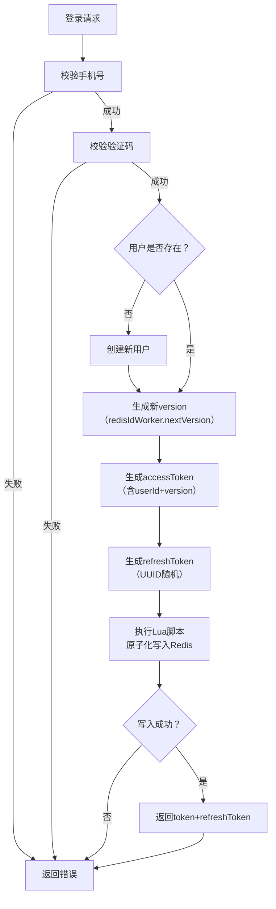
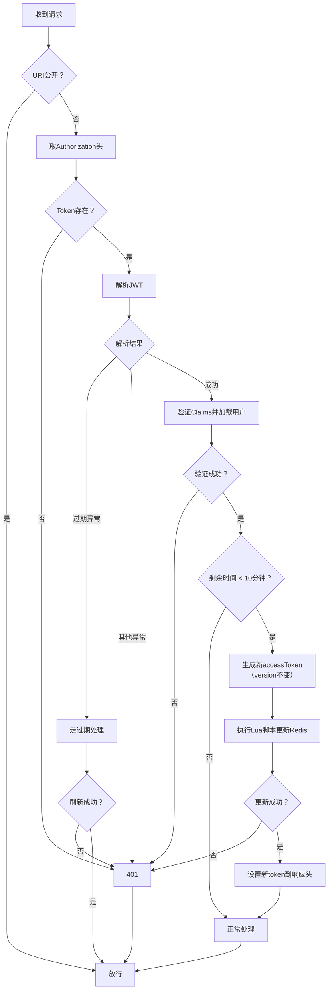
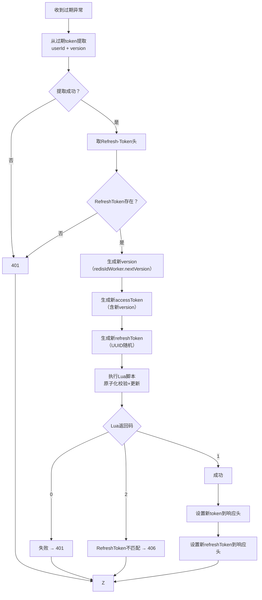

# hm-dianping - 高并发点评平台（黑马点评扩展版）

基于黑马点评课程项目进行的深度扩展与重构，重点优化用户认证登录流程和高并发订单/库存扣减逻辑。项目采用 Spring Boot 技术栈，强调安全、并发一致性与性能优化。

## 项目亮点

- **登录认证模块**：完整重构双令牌机制，实现严格单设备登录 + 安全旋转刷新，防止重放攻击与并发覆盖。
- **订单/库存扣减模块**：Redis 预减 + Lua 原子操作 + RabbitMQ 异步落库，支撑高并发场景下的库存准确性。
- **性能优化**：通过压测数据验证优化效果，吞吐量与数据库压力显著改善。

## 核心功能与技术实现

### 1. 用户认证与双令牌刷新机制

- Access Token 有效期 30 分钟 + Refresh Token 有效期 7 天，支持自动续期。
- 实现单设备登录：以 userId 为键在 Redis 存储当前有效 Access Token，新登录自动使旧 Token 失效。
- Refresh Token 采用**旋转 + 一次性使用**策略，有效防止重放攻击。
- 额外引入**版本号机制**，限制有效 Refresh Token 与任意过期 Access Token 的非法组合使用。
- 刷新流程使用 **Redis + Lua 脚本** 原子执行：检查 key 存在 → 值比对 → 删除旧令牌 → 写入新令牌，避免并发条件下的 Token 覆盖。
- 用户信息缓存于 Redis Hash，显著降低数据库认证压力。
附带login方法流程

Refresh拦截器拦截流程

刷新过期token流程

### 2. 高并发异步库存扣减

- Redis 预减库存 + Lua 脚本原子完成检查、扣减、重复下单校验（单脚本内处理）。
- 下单成功后通过 RabbitMQ 异步投递扣减消息。
- 消息可靠投递采用 Confirm + Return 机制 + 幂等消费表，保证最终一致性与防丢失/重复扣减。
- 压测结果：
  - 库存扣减接口 TP99 下降约 55%。
  - 单机吞吐量稳定 800+ TPS。
  - 系统整体支撑 2000+ TPS 峰值，数据库写压力降低约 80%。

### 3. 点赞功能异步优化（简要）

- 点赞操作先写 Redis（Hash + ZSet），定时任务批量落库。
- Lua 脚本保证原子性，防止重复点赞覆盖。
- 压测吞吐量从 120 req/s 提升至 450 req/s，错误率降至 0%。

## 技术栈

- 后端：Spring Boot、Spring Security、MyBatis
- 数据库：MySQL
- 缓存：Redis（Lua 脚本、Hash、分布式锁相关）
- 消息队列：RabbitMQ（可靠投递、幂等）
- 工具：Maven、Git、JMeter（压测）

## 关键文件位置

- 登录刷新 Lua 脚本：`src/main/resources/redis/refreshToken.lua`（或类似路径，根据实际文件调整）
- 库存扣减 Lua 脚本：`src/main/resources/MqSeckill.lua`
- 拦截器与令牌逻辑：`com.hmdp.interceptor` / `com.hmdp.service.impl` 等包

## 运行与压测

1. 配置 application.yml 中的 Redis、MySQL、RabbitMQ 连接信息。
2. 启动项目：`mvn spring-boot:run` 或 IDE 直接运行。
3. 压测脚本位于项目根目录或 test 目录下的 JMeter 文件（.jmx）。

## 说明

本项目为个人学习与求职作品，代码已尽量模块化、注释清晰。欢迎审阅登录认证与库存扣减部分的实现细节，尤其是 Lua 脚本的原子操作逻辑。

如有问题或建议，欢迎 Issue 或 Pull Request。

最后更新：2026 年 2 月
