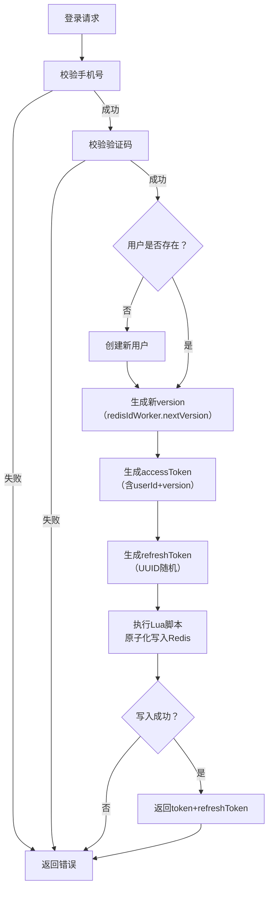

# 登录方法流程

```mermaid
flowchart TD
    A[登录请求] --> B[校验手机号]
    B -->|失败| Z[返回错误]
    
    B -->|成功| C[校验验证码]
    C -->|失败| Z
    
    C -->|成功| D{用户是否存在？}
    D -->|否| E[创建新用户]
    E --> F
    D -->|是| F[生成新version<br>（redisIdWorker.nextVersion）]
    
    F --> G[生成accessToken<br>（含userId+version）]
    G --> H[生成refreshToken<br>（UUID随机）]
    
    H --> I[执行Lua脚本<br>原子化写入Redis]
    I --> J{写入成功？}
    J -->|否| Z
    
    J -->|是| K[返回token+refreshToken]
    K --> Z
```
