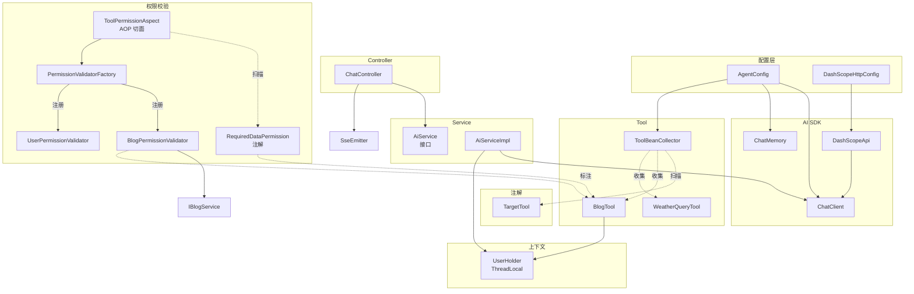
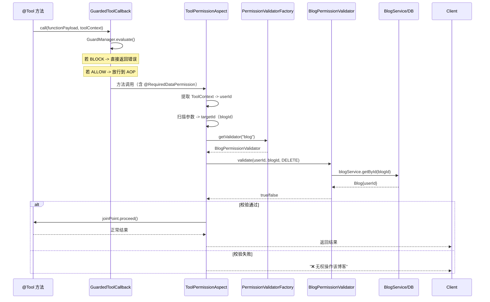
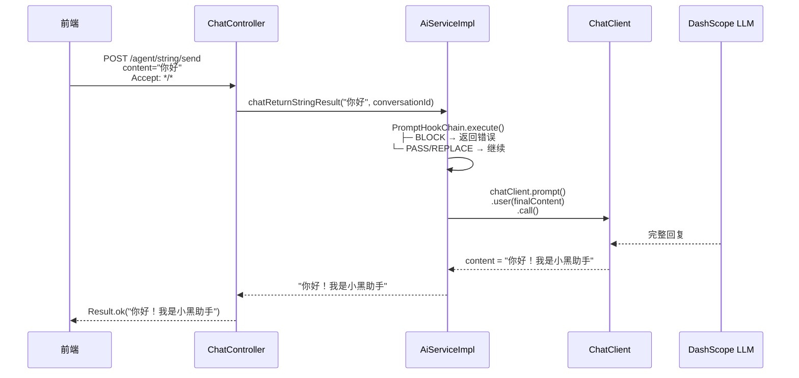
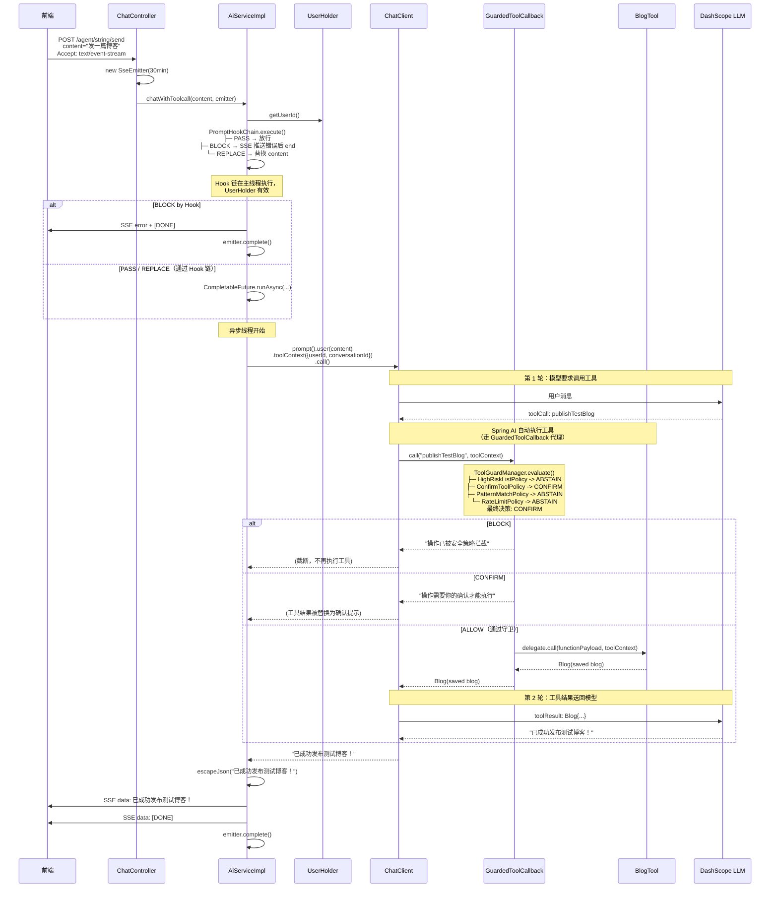

# Agent 模块架构设计

> **版本**: v1.3  
> **最后更新**: 2026-07-22  
> **对应代码路径**: `hm-dianping/src/main/java/com/hmdp/` 下的 `agent/`, `permission/`, `aspect/`, `promptguard/`, `prompthook/`, `exception/`  
> **相关文档**: [SSE后端实现规范](./SSE后端实现规范.md), [推荐购买Agent前端方案](./推荐购买Agent前端方案.md)

---

## 目录

1. [模块定位](#1-模块定位)
2. [整体架构](#2-整体架构)
3. [层叠结构详解](#3-层叠结构详解)
   - [3.1 注解层 —— @TargetTool](#31-注解层--targettool)
   - [3.2 配置层 —— AgentConfig & DashScopeHttpConfig](#32-配置层--agentconfig--dashscopehttpconfig)
   - [3.3 控制层 —— ChatController](#33-控制层--chatcontroller)
   - [3.4 服务层 —— AiService / AiServiceImpl](#34-服务层--aiservice--aiserviceimpl)
   - [3.5 工具层 —— ToolBeanCollector & Tool 实现](#35-工具层--toolbeancollector--tool-实现)
   - [3.6 权限层 —— 可插拔数据权限校验](#36-权限层--可插拔数据权限校验)
   - [3.7 守卫层 —— PromptGuard 工具调用守卫](#37-守卫层--promptguard-工具调用守卫)
   - [3.8 上下文层 —— UserHolder](#38-上下文层--userholder)
   - [3.9 前端层（参考）](#39-前端层参考)
   - [3.10 输入拦截层 —— PromptHook & conversationId](#310-输入拦截层--prompthook--conversationid)
4. [核心数据流](#4-核心数据流)
   - [4.1 JSON 同步模式](#41-json-同步模式)
   - [4.2 SSE 伪流式工具调用模式（含守卫拦截）](#42-sse-伪流式工具调用模式含守卫拦截)
5. [关键设计决策](#5-关键设计决策)
6. [扩展指南](#6-扩展指南)
7. [配置说明](#7-配置说明)
8. [监控与日志](#8-监控与日志)

---

## 1. 模块定位

Agent 模块是 hm-dianping 的"智能层"，通过大语言模型（LLM）为用户提供自然语言驱动的交互体验。

### 1.1 核心能力

| 能力 | 说明 | 状态 |
|------|------|------|
| **自然语言对话** | 用户用中文提问，AI 理解意图并回复 | ✅ 已实现 |
| **工具调用（Function Calling）** | AI 自主决定调用后端工具（查天气、查博客、发布博客） | ✅ 已实现 |
| **双模响应** | 同一端点同时支持 JSON 同步响应 和 SSE 流式推送 | ✅ 已实现 |
| **多轮对话记忆** | 通过 ChatMemory 保留最近 N 轮上下文 | ✅ 已实现 |
| **权限校验** | AOP 切面 + 策略模式校验器，可插拔 | ✅ 已实现 |
| **上下文安全** | 通过 `toolContext` 将当前用户 ID 注入工具调用 | ✅ 已实现 |
| **审批授权** | 敏感工具调用前需用户确认 | 📅 预留 |

### 1.2 技术栈

| 组件 | 选型 | 版本 |
|------|------|------|
| AI 框架 | Spring AI（Alibaba DashScope 适配） | 1.1.2 |
| 底层模型 | DashScope（通义千问） | qwen-plus-2025-07-28 |
| SSE 容器 | Spring `SseEmitter` | 内置于 Spring Web |
| 工具注册 | 自定义注解 `@TargetTool` + 自动扫描 | — |
| 对话记忆 | JDBC 持久化 `MessageWindowChatMemory` | — |
| HTTP 连接池 | Apache HttpClient 5（同步） + Reactor Netty（流式） | — |

---

## 2. 整体架构

### 2.1 分层结构

```
┌─────────────────────────────────────────────────────────────────────────┐
│                         前端（Vue 3）                                    │
│  AiChat.vue → ChatBubble / AgentResultCard                              │
│  src/api/agent.ts → fetch / axios                                        │
└──────────────────────────┬──────────────────────────────────────────────┘
                           │ HTTP / SSE
                           ▼
┌─────────────────────────────────────────────────────────────────────────┐
│                     Controller 层（表现层）                              │
│  ChatController                                                         │
│  ├─ POST /agent/string/send  ← Accept 头协商 → JSON or SSE              │
│  └─ POST /agent/flux/send    (预留)                                     │
└──────────────────────────┬──────────────────────────────────────────────┘
                           │
┌──────────────────────────▼──────────────────────────────────────────────┐
│                      Service 层（业务逻辑）                              │
│  AiService (接口)                                                       │
│  └─ AiServiceImpl (实现)                                                │
│     ├─ chatReturnStringResult()  — 同步模式                             │
│     ├─ chatWithToolcall()        — SSE + 工具调用模式                   │
│     └─ checkPermission()         — 安全审批（重构为 AOP 切面）               │
└──────────────────────────┬──────────────────────────────────────────────┘
                           │
┌──────────────────────────▼──────────────────────────────────────────────┐
│                     Tool 层（工具函数）                                  │
│  ToolBeanCollector (自动收集 + 守卫包装器)                               │
│  ├─ BlogTool           — 博客查询 / 发布                               │
│  └─ WeatherQueryTool   — 天气查询（Demo）                              │
│  所有 ToolCallback 由 GuardedToolCallback 包装后再注册                   │
└──────────────────────────┬──────────────────────────────────────────────┘
                           │
┌──────────────────────────▼──────────────────────────────────────────────┐
│                  Guard 层（工具调用守卫）                                 │
│  GuardedToolCallback (ToolCallback 代理)                                │
│  └─ ToolGuardManager.evaluate() → List<ToolGuardPolicy>                 │
│       ├─ HighRiskListPolicy     — 高危工具精确匹配                      │
│       ├─ ConfirmToolPolicy      — 需确认工具列表                        │
│       ├─ PatternMatchPolicy     — 正则匹配拦截                          │
│       ├─ RateLimitPolicy        — Redis 频率限制                        │
│       └─ ... 纯无状态策略，零业务 Service 依赖                          │
└──────────────────────────┬──────────────────────────────────────────────┘
                           │
┌──────────────────────────▼──────────────────────────────────────────────┐
│                  Permission 层（数据权限校验）                            │
│  ToolPermissionAspect (@Around 切面)                                     │
│  └─ PermissionValidatorFactory → DataPermissionValidator                 │
│       ├─ BlogPermissionValidator   — 博客归属权校验（依赖 IBlogService） │
│       └─ UserPermissionValidator   — 用户身份校验                       │
└──────────────────────────┬──────────────────────────────────────────────┘
                           │
┌──────────────────────────▼──────────────────────────────────────────────┐
│                  Permission 层（数据权限校验）                            │
│  ToolPermissionAspect (@Around 切面)                                     │
│  └─ PermissionValidatorFactory → DataPermissionValidator                 │
│       ├─ BlogPermissionValidator   — 博客归属权校验                     │
│       └─ UserPermissionValidator   — 用户身份校验                       │
└──────────────────────────┬──────────────────────────────────────────────┘
                           │ Spring AI SDK
                           ▼
┌─────────────────────────────────────────────────────────────────────────┐
│                     AI SDK 层（基础设施）                                │
│  DashScopeApi + ChatClient                                              │
│  ├─ 同步: call().content()                                              │
│  ├─ 流式: stream().chatClientResponse().subscribe()                     │
│  └─ 工具: prompt().tools(...).toolContext(...).call()                   │
└─────────────────────────────────────────────────────────────────────────┘
```

### 2.2 模块关系图



---

## 3. 层叠结构详解

### 3.1 注解层 —— `@TargetTool`

**文件**: `annotation/TargetTool.java`

```java
@Target(ElementType.TYPE)
@Retention(RetentionPolicy.RUNTIME)
@Documented
@Component  // 内含 @Component 语义，标注后自动成为 Spring Bean
public @interface TargetTool {
    boolean active() default true;  // 是否激活该工具
}
```

**设计要点**:

| 要点 | 说明 |
|------|------|
| **语义复合** | `@TargetTool` 本身已带 `@Component`，标注一个类 = 声明为 Spring Bean + 标记为 AI 工具，无需额外注解 |
| **开关控制** | `active = false` 可临时停用某工具而不删除代码，`ToolBeanCollector` 启动时自动跳过 |
| **与 Spring AI 的关系** | 只负责标记 Bean 粒度，方法级别的 `@Tool` 注解仍使用 Spring AI 官方 `org.springframework.ai.tool.annotation.Tool` |

---

### 3.2 配置层 —— AgentConfig & DashScopeHttpConfig

#### AgentConfig

**文件**: `config/AgentConfig.java`

```java
@Configuration
@Slf4j
public class AgentConfig {

    @Bean
    public ChatMemory chatMemory() {
        JdbcChatMemoryRepository repository = JdbcChatMemoryRepository.builder()
            .jdbcTemplate(jdbcTemplate).build();
        return MessageWindowChatMemory.builder()
            .maxMessages(10)
            .chatMemoryRepository(repository)
            .build();
    }

    @Bean("aliibabaChatClient")
    public ChatClient chatClient(DashScopeChatModel chatModel, ChatMemory chatMemory,
                                 ToolBeanCollector toolBeanCollector) {
        ToolCallback[] toolCallbacks = toolBeanCollector.getToolCallbacks();

        return ChatClient.builder(chatModel)
            .defaultSystem("你是电商客服，但当用户问天气时，你必须调用 queryWeather 工具，不要自己回答。")
            .defaultAdvisors(MessageChatMemoryAdvisor.builder(chatMemory).build())
            .defaultTools((Object[]) toolCallbacks)
            .build();
    }
}
```

**设计要点**:

| 要素 | 选型 | 理由 |
|------|------|------|
| **记忆存储** | JDBC（`JdbcChatMemoryRepository`） | 开发期便捷，生产建议切换为 Redis |
| **窗口大小** | `maxMessages=10` | 控制 Token 消耗，兼顾多轮上下文 |
| **系统提示词** | 硬编码字符串 | MVP 阶段，后续应外置为配置或数据库 |
| **工具注册** | `defaultTools((Object[]) toolCallbacks)` | 自动扫描 + GuardedToolCallback 包装，增加新工具无需改配置 |

#### DashScopeHttpConfig

**文件**: `config/DashScopeHttpConfig.java`

为 AI API 调用提供独立于业务接口的连接池：

| 模式 | HTTP 客户端 | 连接池参数 | 超时设置 |
|------|-------------|-----------|---------|
| **同步** (JSON) | Apache HttpClient 5 | 最大 200 连接，空闲 30s 回收 | 连接 10s，读取 60s |
| **流式** (SSE) | Reactor Netty | 最大 200 连接，空闲 30s 回收 | 连接 10s，响应 30min |

> **关键**: 流式的 responseTimeout 设为 30min 是为了与 `SseEmitter` 超时对齐，防止模型推理停顿期间 Netty 提前关闭连接。

---

### 3.3 控制层 —— ChatController

**文件**: `controller/ChatController.java`

**路由表**:

| 路径 | 方法 | 说明 |
|------|------|------|
| `POST /agent/string/send` | `chat()` | 主入口，根据 Accept 头切换模式 |
| `POST /agent/flux/send` | `postMethodName()` | 预留 |

**内容协商逻辑**:

```
客户端请求                             后端行为
───────────────────────────────────────────────────────────
POST /agent/string/send?content=xxx   检查 Accept 头
Accept: text/event-stream            ──→ SSE 流式 + 工具调用
Accept: */* 或 无 Accept 头          ──→ 普通 JSON 同步响应
```

**SSE 模式细节**:

```java
SseEmitter emitter = new SseEmitter(30 * 60 * 1000L);  // 30 分钟超时
emitter.onCompletion(() -> log.info("SSE 流完成"));
emitter.onTimeout(() -> log.warn("SSE 流超时"));
emitter.onError(ex -> log.error("SSE 流异常"));
aiService.chatWithToolcall(content, emitter);
return emitter;  // 返回 SseEmitter，Spring MVC 自动处理异步响应
```

---

### 3.4 服务层 —— AiService / AiServiceImpl

**文件**: `service/AiService.java`, `service/impl/AiServiceImpl.java`

#### 接口定义

```java
public interface AiService {
    /** 同步模式：等待完整回复后返回 */
    String chatReturnStringResult(String content);
    
    /** 流式模式（伪流式）：先调用工具，再推送最终结果 */
    void chatWithToolcall(String content, SseEmitter emitter);
}
```

#### 核心实现逻辑

**同步模式** (`chatReturnStringResult`):

```
① 接收用户输入
② 构造 ChatContext（userId、sessionId、history）
③ PromptHookChain.execute() 串行执行所有 PromptHook
   ├─ 全部 PASS → 原文本放行
   ├─ 任一 REPLACE → 替换输入文本
   ├─ 任一 BLOCK → 直接返回错误信息
   └─ 异常 → Fail-Open 降级 PASS
④ chatClient.prompt().user(content).call().content()
⑤ 返回完整文本
```

**SSE 工具调用模式** (`chatWithToolcall`):

```
① 接收用户输入 + SseEmitter
② 从 UserHolder 获取当前用户 ID
③ 构造 ChatContext（userId、sessionId、history）
④ PromptHookChain.execute() 串行执行所有 PromptHook
   ├─ 全部 PASS → 原文本放行
   ├─ 任一 REPLACE → 替换当前输入文本（串行修饰链）
   ├─ 任一 BLOCK → 立即短路，SSE 推送错误后结束
   └─ 异常 → Fail-Open 降级 PASS，不阻塞业务
⑤ 异步线程执行（CompletableFuture.runAsync）
   ├─ 调用 chatClient.prompt()
   │    .user(finalContent)
   │    .toolContext(Map.of("userId", userId, "conversationId", sessionId))
   │    .call().content()
   │       ├─ 模型返回 tool call
   │       ├─ GuardedToolCallback 守卫评估
   │       └─ 自动执行 @Tool 方法
   ├─ emitter.send(escapeJson(result))
   └─ emitter.complete()
```

> **为什么是"伪流式"？**  
> 当前实现先完整执行工具调用（`call().content()` 阻塞），拿到最终结果后再一次性通过 SSE 推送给前端。  
> 真正的流式应该是 `stream()` + 逐 token 推送，但由于 Spring AI 1.1.2 的流式模式下工具调用和文本生成穿插，实现复杂度较高，当前采用折中方案。

#### 数据权限校验（已迁移至 AOP 切面）

> 数据权限校验已从 Service 层迁移至独立的 AOP 切面，详见 [3.6 权限层](#36-权限层--可插拔数据权限校验)。  
> 此处仅保留设计说明，供历史参考。

**设计演进**:

| 版本 | 方式 | 说明 |
|------|------|------|
| v1.0 | Service 层 `checkPermission()` | 硬编码 if-else，扩展性差 |
| v1.1 | AOP 切面 + 策略模式 | 可插拔校验器，新增资源无需改现有代码 |

---

### 3.5 工具层 —— ToolBeanCollector & Tool 实现

#### ToolBeanCollector（自动收集器）

**文件**: `agent/tool/ToolBeanCollector.java`

**工作流程**:

```
Spring 容器启动
      │
      ▼
ToolBeanCollector.setApplicationContext()
      │
      ▼
applicationContext.getBeansWithAnnotation(TargetTool.class)
      │
      ├─ 遍历所有 @TargetTool Bean
      ├─ 处理 CGLIB 代理（取原始类上的注解）
      ├─ 检查 annotation.active()
      │    ├─ true  → ToolCallbacks.from(bean) → ToolCallback[]
      │    │          每个 ToolCallback → new GuardedToolCallback(...)
      │    │          → 加入收集列表
      │    └─ false → 跳过（日志记录）
      │
      ▼
toolCallbacks = collected.toArray()  ← 传入 ChatClient.Builder.defaultTools()
```

#### BlogTool

**文件**: `agent/tool/impl/BlogTool.java`

| 工具方法 | 描述 | 参数 | 安全约束 |
|---------|------|------|---------|
| `queryPublishedBlogs` | 查询当前用户点赞前 10 篇博客 | `ToolContext` → 提取 `userId` | 无需（查自己的数据） |
| `publishTestBlog` | 发布一篇测试博客 | `ToolContext` → 提取 `userId` | 无需（写自己的数据） |
| `queryBlogsByTitle` | 模糊查询博客标题 | `title: String` | 无用户限制 |

> **关键设计**: 工具方法通过 `ToolContext toolContext` 参数接收用户上下文（`userId`），而非从 `UserHolder` 直接获取。这是因为工具调用在 AI SDK 内部线程执行，`ThreadLocal` 可能已丢失。

#### WeatherQueryTool

**文件**: `agent/tool/impl/WeatherQueryTool.java`

```java
@TargetTool(active = true)
public class WeatherQueryTool {
    @Tool(description = "查询天气，参数为城市，仅用于测试工具调用")
    public String queryWeather(@ToolParam(description = "城市名称,例如北京") String city) {
        return "The weather in " + city + " is sunny";
    }
}
```

> 纯 Demo 工具，用于验证 Function Calling 功能。系统提示词中已强制要求：用户问天气时必须调用此工具。

#### 权限注解 `@RequiredDataPermission`

**文件**: `permission/annotation/RequiredDataPermission.java`

```java
@Target(ElementType.METHOD)
@Retention(RetentionPolicy.RUNTIME)
@Documented
public @interface RequiredDataPermission {
    DataAction action() default DataAction.READ;   // 操作类型
    String resource() default "";                  // 资源类型，如 "blog"
}
```

**用法**: 标注在 `@Tool` 方法上，AOP 切面自动拦截并校验：

```java
@Tool(description = "删除博客")
@RequiredDataPermission(resource = "blog", action = DataAction.DELETE)
public Object deleteBlog(ToolContext ctx, @ToolParam Long blogId) {
    blogService.removeById(blogId);
    return "删除成功";
}
```

---

### 3.6 权限层 —— 可插拔数据权限校验

**新增于 v1.1** — 替代了 v1.0 Service 层硬编码的 `checkPermission()`。

#### 设计目标

| 目标 | 说明 |
|------|------|
| **开闭原则** | 新增资源只需新增校验器实现类，零修改现有代码 |
| **关注点分离** | AOP 切面只负责路由，校验逻辑委托给独立的策略实现 |
| **可观测性** | 校验通过/失败均有结构化日志，便于审计 |

#### 架构组件

| 组件 | 文件 | 角色 |
|------|------|------|
| `@RequiredDataPermission` | `permission/annotation/RequiredDataPermission.java` | 注解，标记哪些 `@Tool` 方法需要校验 |
| `ToolPermissionAspect` | `aspect/ToolPermissionAspect.java` | AOP 切面，提取参数 → 路由到工厂 → 放行或拒绝 |
| `DataPermissionValidator` | `permission/validator/DataPermissionValidator.java` | 策略接口，定义校验契约 |
| `PermissionValidatorFactory` | `permission/validator/PermissionValidatorFactory.java` | Spring 工厂，自动收集所有 Validator Bean |
| `BlogPermissionValidator` | `permission/validator/impl/BlogPermissionValidator.java` | 博客归属权校验 |
| `UserPermissionValidator` | `permission/validator/impl/UserPermissionValidator.java` | 用户身份校验 |

#### 核心流程



#### 扩展方式

新增一种资源（如 `order`）只需两步：

1. 创建 `OrderPermissionValidator` 实现 `DataPermissionValidator`
2. 标注 `@Component`，实现 `validate()` 方法

```java
@Component
public class OrderPermissionValidator implements DataPermissionValidator {
    @Override public String getResourceType() { return "order"; }
    @Override public String getResourceLabel() { return "订单"; }
    @Override
    public boolean validate(Long userId, Object targetId, DataAction action) {
        Order order = orderService.getById(((Number) targetId).longValue());
        return order != null && userId.equals(order.getUserId());
    }
}
```

工厂启动时自动注册，切面自动路由，无需修改任何现有代码。

---

### 3.7 守卫层 —— PromptGuard 工具调用守卫

**新增于 v1.2** — 在 ToolCallback 代理层实现第一道防线，前置拦截高风险调用。

#### 设计目标

| 目标 | 说明 |
|------|------|
| **提前拦截** | 在 AI 实际执行工具前评估风险，避免调用发送 API 请求 |
| **纯无状态** | 所有策略实现仅依赖 YAML 配置、Redis 计数器、正则匹配，不引入业务 Service |
| **关注点分离** | Guard 层做风险前置评估，AOP 层做数据归属权后置校验，职责不重叠 |

#### 核心组件

| 组件 | 文件 | 角色 |
|------|------|------|
| `ToolGuardPolicy` | `promptguard/ToolGuardPolicy.java` | `@FunctionalInterface`，定义 `vote(ToolInvocationContext) -> Vote` |
| `ToolGuardManager` | `promptguard/ToolGuardManager.java` | `@Component`，收集所有 Policy Bean，评估并聚合决策 |
| `GuardedToolCallback` | `promptguard/GuardedToolCallback.java` | 实现 `ToolCallback`，代理模式包装原始回调 |
| `ToolInvocationContext` | `promptguard/ToolInvocationContext.java` | 上下文参数对象（Builder 模式） |
| `GuardResult` | `promptguard/GuardResult.java` | 决策结果（ALLOW / BLOCK / CONFIRM） |
| `Vote` | `promptguard/Vote.java` | 策略投票枚举（ALLOW / BLOCK / CONFIRM / ABSTAIN） |
| `PromptGuardProperties` | `config/PromptGuardProperties.java` | `@ConfigurationProperties`，从 YAML 加载规则 |

#### 内置策略实现

| 策略 | 文件 | 判断依据 | 无状态保证 |
|------|------|---------|-----------|
| `HighRiskListPolicy` | `promptguard/policy/HighRiskListPolicy.java` | `hmdp.prompt-guard.block-tools` 精确匹配 `ToolDefinition.name()` | ✅ 仅读 YAML |
| `ConfirmToolPolicy` | `promptguard/policy/ConfirmToolPolicy.java` | `hmdp.prompt-guard.confirm-tools` 精确匹配 | ✅ 仅读 YAML |
| `PatternMatchPolicy` | `promptguard/policy/PatternMatchPolicy.java` | 正则匹配 `toolName` 和 `arguments` 中的敏感信息 | ✅ 纯正则 |
| `RateLimitPolicy` | `promptguard/policy/RateLimitPolicy.java` | Redis 计数器 `guard:rate:{sessionId}`，超出阈值拦截 | ✅ 仅操作 Redis |

#### 决策聚合规则

```
投票收集 -> 汇总
  ├─ 任一 BLOCK    -> 最终 BLOCK（一票否决）
  ├─ 无 BLOCK + 任一 CONFIRM -> 最终 CONFIRM（需用户确认）
  └─ 全部 ALLOW/ABSTAIN -> 最终 ALLOW（放行）
```

#### 配置示例

```yaml
hmdp:
  prompt-guard:
    block-tools:
      - deleteBlog           # 精确匹配工具名称
      - deleteAllUsers
    confirm-tools:
      - publishBlog
    block-patterns:
      - pattern: "(delete|drop|truncate)"
        target: "tool-name"  # 匹配工具名
    confirm-patterns:
      - pattern: "admin"
        target: "arguments"  # 匹配参数内容
    rate-limit:
      max-per-session: 30    # 每会话最多 30 次调用
      window-seconds: 60     # 窗口 60 秒
```

### 3.8 上下文层 —— UserHolder

**文件**: `utils/UserHolder.java`

```java
public class UserHolder {
    private static final ThreadLocal<Long> tl = new ThreadLocal<>();           // 用户 ID
    private static final ThreadLocal<UserDTO> userDTOThreadLocal = new ThreadLocal<>();  // 完整用户信息
    
    public static Long getUserId() { ... }
    public static UserDTO getUserDTO() { ... }
}
```

**使用注意**:

| 使用场景 | 获取方式 | 说明 |
|---------|---------|------|
| Controller / 同步 Service | `UserHolder.getUserId()` | 请求线程内直接获取 |
| 工具方法 | `toolContext.getContext().get("userId")` | `AiServiceImpl` 通过 `.toolContext(Map.of("userId", userId))` 传入 |

> **⚠️ 线程安全**: `AiServiceImpl.chatWithToolcall()` 使用 `CompletableFuture.runAsync()` 异步执行。虽然 `SseEmitter` 的异步请求仍处于同一个 Servlet 异步上下文，但为了健壮性，工具方法应优先使用 `toolContext` 参数而非 `UserHolder`。

---

### 3.9 前端层（参考）

前端方案详见 [推荐购买Agent前端方案.md](./推荐购买Agent前端方案.md)，此处仅列出接口契约：

#### 后端 API 接口

| 路径 | 方法 | 请求 | 响应 |
|------|------|------|------|
| `POST /agent/string/send` | POST | `content: string` + `Accept` 头 | JSON `Result` 或 SSE 流 |
| `GET /api/agent/scenes` | GET | — | `Result<SceneTag[]>` |
| `POST /api/agent/recommend` | POST | `RecommendRequest` | `Result<RecommendResult>` |

> **注意**: `/agent/string/send` 是 AI 对话主接口，SSE 模式已实现；`GET /agent/scenes` 和 `POST /agent/recommend` 是前端方案中设计的推荐专用接口，尚未在后端实现。

#### 前端 SSE 读取模式

```typescript
// 前端使用 fetch + ReadableStream 读取 SSE
fetch('/agent/string/send', {
  method: 'POST',
  headers: { 'Accept': 'text/event-stream' },
  body: new URLSearchParams({ content })
}).then(async response => {
  const reader = response.body.getReader()
  while (true) {
    const { done, value } = await reader.read()
    if (done) break
    // 解析 data: 行
    // 遇到 [DONE] 停止
    // 遇到 JSON error → 业务异常处理
  }
})
```

### 3.10 输入拦截层 —— PromptHook & conversationId

**新增于 v1.3** — 在用户输入发送给 LLM 之前通过链式 Hook 做安全检测、文本脱敏、指令增强。

#### 核心组件（`prompthook` 包）

| 组件 | 文件 | 角色 |
|------|------|------|
| `PromptHook` | `prompthook/PromptHook.java` | `@FunctionalInterface`，`beforePrompt(originalInput, currentInput, context)` |
| `HookResult` | `prompthook/HookResult.java` | 决策 PASS / BLOCK / REPLACE，可选 replacedHistory |
| `ChatContext` | `prompthook/ChatContext.java` | 强类型上下文（userId, sessionId, `List<Message> history`） |
| `PromptHookChain` | `prompthook/PromptHookChain.java` | `@Component` 自动收集 Hook Bean 串行执行 |
| `SensitiveWordHook` | `prompthook/impl/SensitiveWordHook.java` | 敏感词脱敏（示例） |
| `InjectionDetectHook` | `prompthook/impl/InjectionDetectHook.java` | Prompt 注入检测（示例） |

#### 执行规则

```
串行每个 Hook：
  PASS     → currentInput 不变，继续下一个
  REPLACE  → 替换 currentInput，后续 Hook 在替换文本上继续
  BLOCK    → 立即短路，返回阻断原因
  异常     → Fail-Open 降级 PASS，不阻塞业务
```

- `originalInput` 不可变，安全检测始终基于原始值
- `currentInput` 串行传递，增强 Hook 在此之上追加
- `replacedHistory` 可选清洗历史，发现投毒时替换 ChatMemory

#### conversationId 多轮会话

```
首次请求（无 conversationId）：后端 UUID → 返回前端
后续请求（携带 conversationId）：ChatMemory 按 ID 隔离对话
```

- JSON 模式返回 `{ "content": "回复", "conversationId": "xxx" }`
- SSE 模式首条推送 `data: conversationId:xxx`，前端解析后下次请求传入


---

## 4. 核心数据流

### 4.1 JSON 同步模式



### 4.2 SSE 伪流式工具调用模式（含守卫拦截）



---

## 5. 关键设计决策

### 5.1 为什么用 `@TargetTool` 而非 Spring AI 原生注册？

| 方案 | 优点 | 缺点 |
|------|------|------|
| **Spring AI 原生** (`ChatClient.builder().defaultTools(Tool1, Tool2)`) | 无额外抽象，开箱即用 | 每新增工具都要改 `AgentConfig`，违背开闭原则 |
| **`@TargetTool` + 自动扫描** ✅ | 新增工具只需加注解，零配置修改 | 多了一层自定义注解 |

**结论**: 项目中工具会持续增加（天气、博客、店铺查询等），自动扫描避免了配置文件的频繁修改。

### 5.2 为什么 SSE 模式是"伪流式"？

当前实现：先完整执行 `call().content()` 阻塞调用，拿到最终结果后通过 SSE 一次性推送。

**原因**:

| 因素 | 说明 |
|------|------|
| Spring AI 1.1.2 流式限制 | `stream().chatClientResponse()` 流中 tool call 和 text chunk 穿插，手动拼接逻辑复杂 |
| 工具调用天然阻断 | 模型发出 tool call → 等待工具执行 → 继续推理。整个链式过程中间状态对前端无意义 |
| 前端体验可接受 | 伪流式下用户看到的是完整回复而非逐字输出，对于推荐类场景（展示商铺卡片）体验已足够 |

**改进方向**: 实现真流式（逐 token 推送 + 工具调用中间状态，通过 SSE 事件类型区分），见 Roadmap《SSE 真流式支持》。

### 5.3 为什么工具方法用 `ToolContext` 而非 `UserHolder`？

`UserHolder` 基于 `ThreadLocal`，仅在当前请求线程中有效。`AiServiceImpl` 使用 `CompletableFuture.runAsync()` 异步执行时，如果线程池中的线程未继承 `ThreadLocal`，`UserHolder.getUserId()` 会抛出 `IllegalArgumentException`。

**解决方案**: `ChatClient` 的 `.toolContext(Map.of("userId", userId))` 在请求线程中提取 userId，通过 AI SDK 内部传递到工具执行的线程，工具方法通过 `ToolContext` 参数接收。

### 5.4 为什么权限校验用策略模式 + AOP？

| 方案 | 优点 | 缺点 |
|------|------|------|
| **if-else 硬编码**（v1.0） | 简单直接 | 每新增资源都要改切面，违背 OCP |
| **策略模式 + AOP**（v1.1）✅ | 新增资源只需加实现类，无需改现有代码 | 多了一层接口抽象 |

**结论**: 项目中 AI 工具会持续增加（博客、店铺、订单等），每种资源的归属权校验逻辑不同（查表、比 ID、查关联关系等）。策略模式允许每种资源独立实现校验逻辑，工厂自动注册，AOP 切面做纯路由，三者各司其职。

---

### 5.5 为什么连接池单独配置？

| 问题 | 默认行为 | 自定义配置 |
|------|---------|-----------|
| 同步调用 | `HttpURLConnection` 无连接池，每次新建 TCP | Apache HttpClient 5 连接池（200 连接） |
| 流式调用 | Netty 默认参数（500 连接，60s 获取超时） | 保守参数（200 连接，10s 获取超时） |
| 响应超时 | 流式无超时或默认值 | 30min 对齐 SseEmitter |
| 连接泄漏 | 高并发下可能耗尽临时端口 | 空闲 30s 回收 + 后台 eviction |

---


### 5.6 为什么设计两层守卫架构（PromptGuard + AOP）？

| 维度 | PromptGuard（ToolCallback 代理层） | @RequiredDataPermission（AOP 层） |
|------|-----------------------------------|----------------------------------|
| **拦截时机** | `call()` 方法执行前，最早介入点 | `@Tool` 方法执行前，业务代码前一道防线 |
| **依赖范围** | 纯无状态：YAML、Redis、正则 | 有状态：IBlogService、IShopService 等业务 Service |
| **判断依据** | 工具名称、参数内容、调用频率 | 数据归属权、用户身份、操作类型 |
| **失败后果** | 返回错误字符串，不执行工具 | 抛出异常或返回无权提示 |
| **典型场景** | "批量删除全部博客" -> 工具名含 delete 被拦截 | "删除别人已发布的博客" -> 校验 blog.userId != 当前 userId |

**分层理由**:

1. **职责分离**: 风险等级评估（是否允许调用此工具）与数据权限验证（是否有权操作此数据）是两种不同关切
2. **性能**: 无状态的策略（正则匹配、Redis 计数器）可在几十微秒内完成，无需查表；若全部拦截则跳过耗时的 AOP 校验
3. **安全深度**: 即使 AOP 切面因配置错误或类加载问题失效，第一层守卫仍然起作用（防御纵深）
4. **扩展性**: LLM 安全工程师可只关注 PromptGuard 策略（全 YAML 配置），后端工程师只关注验证器实现，互不干扰

### 5.7 GuardedToolCallback 为什么选代理模式而非继承？

| 方案 | 优点 | 缺点 |
|------|------|------|
| **继承** ToolCallback 基类 | 简单直接 | Spring AI 的 ToolCallback 是接口而非基类，且 ToolCallbacks.from() 返回匿名实现，无法继承 |
| **代理模式**（持有委托对象）✅ | 对原始实现零侵入，组合灵活 | 需要转发所有接口方法 |

**选择代理模式的理由**: ToolCallbacks.from(bean) 返回的 ToolCallback 实例是 Spring AI 框架内部生成的匿名类，类型不可知。代理模式只需要持有 ToolCallback 接口引用即可完成包装。

### 5.8 为什么 RateLimitPolicy 使用 Redis 而非本地计数器？

| 方案 | 优点 | 缺点 |
|------|------|------|
| **本地计数器**（AtomicInteger + 定时重置） | 零外部依赖 | 重启丢失、多实例无效 |
| **Redis 计数器** ✅ | 重启保持、多实例共享、自动过期 | 多一次网络 I/O（降级策略已处理连接异常） |


## 6. 扩展指南

### 6.1 添加一个新工具

**三步完成**:

**Step 1** — 新建工具类，标注 `@TargetTool`：

```java
@TargetTool(active = true)
public class ShopQueryTool {
    
    @Resource
    private IShopService shopService;
    
    @Tool(description = "根据店铺ID查询店铺详细信息")
    public Shop queryShopById(@ToolParam(description = "店铺ID") Long id) {
        return shopService.getById(id);
    }
    
    @Tool(description = "查询当前用户最近的浏览记录", 
          returnDirect = false)  // 工具结果发回给模型继续推理
    public List<Shop> queryRecentViews(ToolContext toolContext) {
        Long userId = (Long) toolContext.getContext().get("userId");
        return shopService.queryRecentByUserId(userId);
    }
}
```

**Step 2** — 重启应用，`ToolBeanCollector` 自动发现并注册。

**Step 3** — 必要时更新 `AgentConfig` 中的系统提示词，告诉模型何时使用新工具。

### 6.2 工具方法设计规范

| 规则 | 说明 |
|------|------|
| **`@Tool(description)` 必填** | 描述要清晰，LLM 据此决定是否调用 |
| **权限敏感方法需加 `@RequiredDataPermission`** | 指明 resource + action，AOP 自动校验 |
| **`@ToolParam(description)` 可选但推荐** | 参数描述帮助 LLM 正确生成参数值 |
| **接收 `ToolContext` 获取用户信息** | 不要直接使用 `UserHolder` |
| **返回类型尽量具体** | Spring AI 会自动序列化为 JSON 送给模型 |
| **返回类型尽量具体** | Spring AI 会自动序列化为 JSON 送给模型 |
| **幂等性** | 查询类工具应当幂等；写入工具需考虑重试场景 |
| **权限校验** | 操作他人数据的工具方法需加 `@RequiredDataPermission` 注解 |

### 6.3 工具 active 开关

```java
// 临时停用而不删除代码
@TargetTool(active = false)
public class DeprecatedTool { ... }
```

---

## 7. 配置说明

### 7.1 关键配置项

```yaml
spring:
  ai:
    dashscope:
      api-key: ${DASHSCOPE_API_KEY}           # DashScope API 密钥
      chat:
        model: qwen-plus-2025-07-28           # 模型版本
        api-base: https://...                  # 自定义 API 地址（兼容模式）
        memory:
          repository:
            jdbc:
              initialize-schema: always        # 自动建表
              platform: mariadb                # 数据库类型
```

### 7.2 线程池配置（当前缺失）

`AiServiceImpl.chatWithToolcall()` 使用 `CompletableFuture.runAsync()` 异步执行，但**未指定线程池**，将使用 `ForkJoinPool.commonPool()`。建议在 `SchedulingThreadConfig` 中补充 AI 专用线程池：

```java
@Bean("aiTaskExecutor")
public Executor aiTaskExecutor() {
    ThreadPoolTaskExecutor executor = new ThreadPoolTaskExecutor();
    executor.setCorePoolSize(2);
    executor.setMaxPoolSize(4);
    executor.setQueueCapacity(100);
    executor.setThreadNamePrefix("ai-worker-");
    executor.setRejectedExecutionHandler(new CallerRunsPolicy());  // 阻塞调用方
    executor.initialize();
    return executor;
}
```

---

## 8. 监控与日志

### 8.1 日志配置

```yaml
logging:
  level:
    com.hmdp.service.impl: DEBUG    # 查看 AI 调用流程
    com.hmdp.config: DEBUG          # 查看连接池初始化和工具注册
    com.hmdp.agent.tool: DEBUG      # 查看工具调用日志
    com.hmdp.promptguard: DEBUG      # 查看守卫评估详细日志
```

### 8.2 关键监控指标

| 指标 | 获取方式 | 告警阈值 |
|------|---------|---------|
| AI 调用耗时 | 日志 `AI 调用：...AI 回复：...` | > 30s |
| 工具调用成功率 | `工具调用完成` vs `AI SSE 工具调用异常` | < 95% |
| SSE 流超时 | `SSE 流超时` 日志 | 出现即告警 |
| 连接池状态 | HttpClient/Netty 内置 Metrics | 活跃连接 > 80% |

---

## 附：文件清单

### Agent 模块

| 文件路径 | 角色 |
|---------|------|
| `annotation/TargetTool.java` | 工具标记注解 |
| `agent/config/AgentConfig.java` | ChatClient + ChatMemory 装配 |
| `agent/config/DashScopeHttpConfig.java` | DashScope HTTP 连接池 |
| `agent/controller/ChatController.java` | SSE/JSON 双模入口 |
| `agent/service/AiService.java` | AI 服务接口 |
| `agent/service/impl/AiServiceImpl.java` | AI 服务实现（含工具调用） |
| `agent/tool/ToolBeanCollector.java` | @TargetTool 自动扫描器 + GuardedToolCallback 包装 |
| `agent/tool/impl/BlogTool.java` | 博客工具（查询/发布） |
| `agent/tool/impl/WeatherQueryTool.java` | 天气查询 Demo |

### 权限校验模块

| 文件路径 | 角色 |
|---------|------|
| `permission/annotation/RequiredDataPermission.java` | 数据权限校验注解 |
| `permission/enums/DataAction.java` | 操作类型枚举（READ/CREATE/UPDATE/DELETE） |
| `permission/validator/DataPermissionValidator.java` | 权限校验策略接口 |
| `permission/validator/PermissionValidatorFactory.java` | 校验器工厂 |
| `permission/validator/impl/BlogPermissionValidator.java` | 博客归属权校验器 |
| `permission/validator/impl/UserPermissionValidator.java` | 用户身份校验器 |
| `aspect/ToolPermissionAspect.java` | 数据权限校验 AOP 切面 |

### PromptGuard 守卫模块

| 文件路径 | 角色 |
|---------|------|
| `promptguard/ToolGuardPolicy.java` | 守卫策略函数式接口 |
| `promptguard/ToolGuardManager.java` | 策略收集与决策聚合 |
| `promptguard/GuardedToolCallback.java` | ToolCallback 代理包装器 |
| `promptguard/ToolInvocationContext.java` | 守卫评估上下文（Builder 模式） |
| `promptguard/GuardResult.java` | 决策结果对象（ALLOW/BLOCK/CONFIRM） |
| `promptguard/Vote.java` | 策略投票枚举 |
| `promptguard/policy/HighRiskListPolicy.java` | 高危工具列表策略 |
| `promptguard/policy/ConfirmToolPolicy.java` | 需确认工具列表策略 |
| `promptguard/policy/PatternMatchPolicy.java` | 正则匹配策略 |
| `promptguard/policy/RateLimitPolicy.java` | Redis 频率限制策略 |

### PromptHook 输入拦截模块

| 文件路径 | 角色 |
|---------|------|
| `prompthook/PromptHook.java` | 输入拦截函数式接口 |
| `prompthook/HookResult.java` | 决策结果（PASS/BLOCK/REPLACE） |
| `prompthook/ChatContext.java` | 强类型上下文（Builder 模式） |
| `prompthook/PromptHookChain.java` | 链式执行器（Fail-Open） |
| `prompthook/impl/SensitiveWordHook.java` | 敏感词脱敏（示例） |
| `prompthook/impl/InjectionDetectHook.java` | Prompt 注入检测（示例） |
| `config/PromptGuardProperties.java` | YAML 配置绑定 |

### 基础设施

| 文件路径 | 角色 |
|---------|------|
| `utils/UserHolder.java` | 用户上下文持有者 |
| `exception/WebExceptionAdvice.java` | 全局异常处理 |
