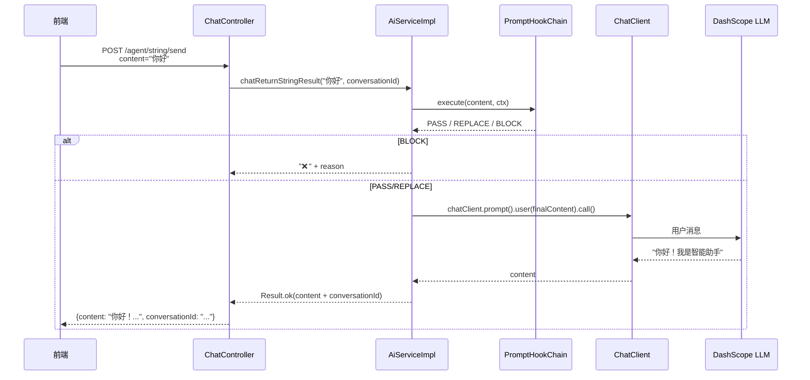
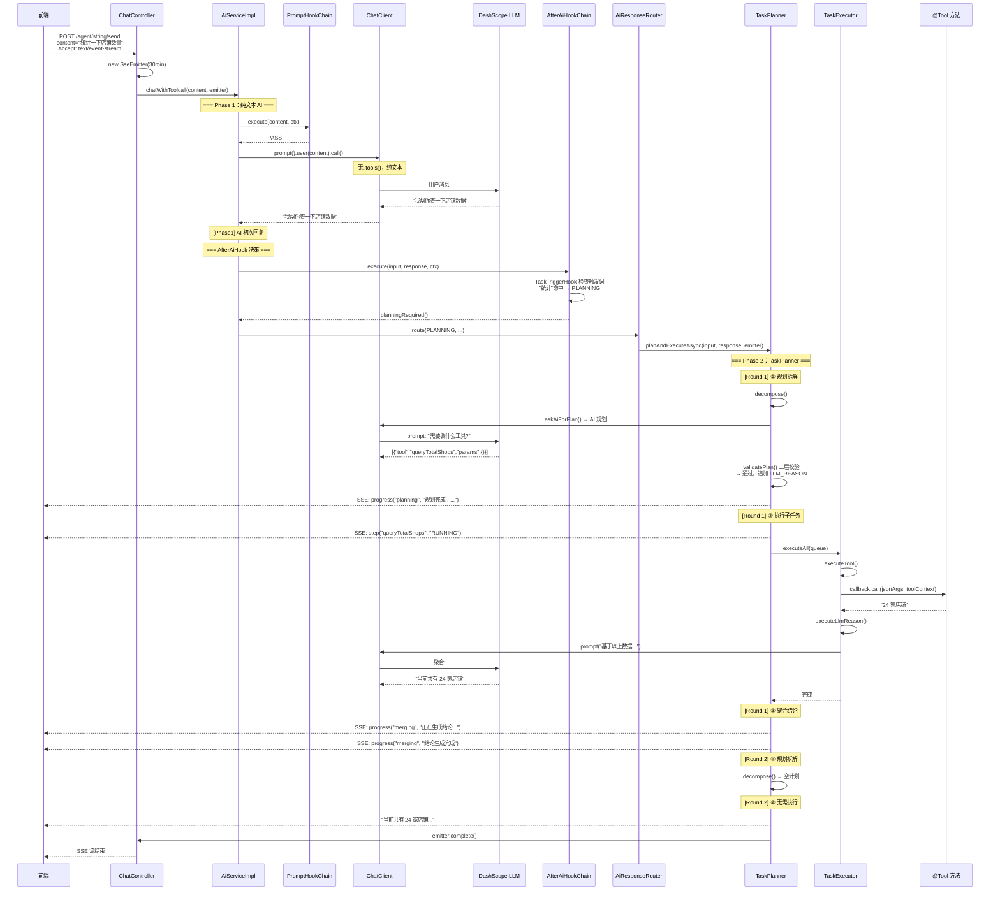
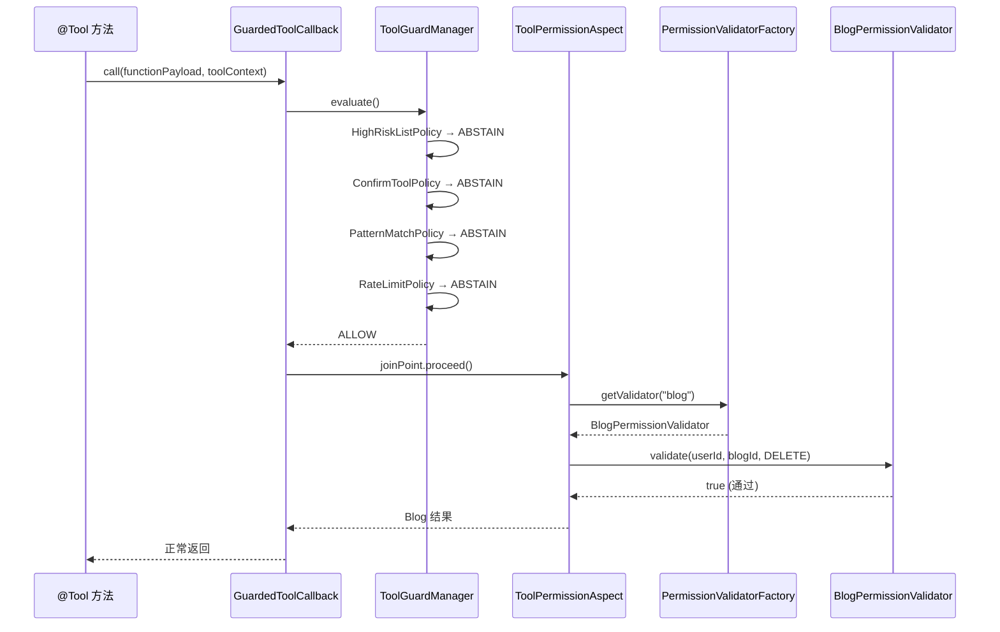

# Agent 模块架构设计

> **版本**: v2.0  
> **最后更新**: 2026-07-24  
> **对应代码路径**: `hm-dianping/src/main/java/com/hmdp/` 下的 `agent/`, `permission/`, `aspect/`, `promptguard/`, `prompthook/`, `exception/`  
> **相关文档**: [Agent任务队列方案](./Agent任务队列方案.md), [Agent模块简历亮点](./Agent模块简历亮点.md), [SSE后端实现规范](./SSE后端实现规范.md)

---

## 目录

1. [模块定位](#1-模块定位)
2. [整体架构](#2-整体架构)
3. [层叠结构详解](#3-层叠结构详解)
4. [核心数据流](#4-核心数据流)
5. [关键设计决策](#5-关键设计决策)
6. [扩展指南](#6-扩展指南)
7. [配置说明](#7-配置说明)
8. [监控与日志](#8-监控与日志)

---

## 1. 模块定位

Agent 模块是 hm-dianping 的"智能层"，通过大语言模型（LLM）为用户提供自然语言驱动的交互体验。

### 1.1 核心能力

| 能力 | 说明 | 状态 |
|------|------|------|
| **自然语言对话** | 用户用中文提问，AI 理解意图并回复 | ✅ 已实现 |
| **工具调用（Function Calling）** | AI 规划后执行后端工具（查天气、查博客、发布博客） | ✅ 已实现 |
| **双模响应** | 同一端点同时支持 JSON 同步响应 和 SSE 流式推送 | ✅ 已实现 |
| **多轮对话记忆** | 通过 ChatMemory 保留最近 10 轮上下文 | ✅ 已实现 |
| **权限校验** | AOP 切面 + 策略模式校验器，可插拔 | ✅ 已实现 |
| **上下文安全** | 通过 `toolContext` 将当前用户 ID 注入工具调用 | ✅ 已实现 |
| **审批授权** | 敏感工具调用前需用户确认 | 📅 预留 |

### 1.2 技术栈

| 组件 | 选型 | 版本 |
|------|------|------|
| AI 框架 | Spring AI（Alibaba DashScope 适配） | 1.1.2 |
| 底层模型 | DashScope（通义千问） | qwen-plus-2025-07-28 |
| SSE 容器 | Spring `SseEmitter` | 内置于 Spring Web |
| 工具注册 | 自定义注解 `@TargetTool` + 自动扫描 | — |
| 对话记忆 | JDBC 持久化 `MessageWindowChatMemory` | — |
| HTTP 连接池 | Apache HttpClient 5（同步） + Reactor Netty（流式） | — |

---

## 2. 整体架构

### 2.1 两阶段架构

Agent 模块采用**两阶段设计**，核心思想是**先规划后执行**：

```
Phase 1: AI 纯文本回复（不绑工具）
    → AfterAiHookChain 决策
      ├─ PASS     → 直接返回
      ├─ BLOCK    → 返回错误
      └─ PLANNING → Phase 2

Phase 2: TaskPlanner 规划执行
    → decompose() —— AI 规划 + Java 三层校验
    → executeAll() — 串行执行 TOOL_CALL
    → merge()      —— LLM_REASON 聚合结论
    → 最多 5 轮
```

相比"第一轮 AI 就带工具"的方案，两阶段的核心收益：
- 工具不会重复执行（Phase 1 根本未注册工具）
- 避免去重机制（不再需要脆弱的 `markAiCompletedTools` 关键词匹配）
- 日志阶段清晰，便于排查

### 2.2 分层结构

```
┌─────────────────────────────────────────────────────────────────────────┐
│                         前端（Vue 3）                                    │
│  AiChat.vue → src/api/agent.ts → axios / fetch                          │
└──────────────────────────┬──────────────────────────────────────────────┘
                           │ HTTP / SSE
                           ▼
┌─────────────────────────────────────────────────────────────────────────┐
│                     Controller 层                                       │
│  ChatController                                                         │
│  └─ POST /agent/string/send  ← Accept 头协商 → JSON or SSE             │
└──────────────────────────┬──────────────────────────────────────────────┘
                           │
┌──────────────────────────▼──────────────────────────────────────────────┐
│                      Service 层（编排入口）                               │
│  AiService (接口) / AiServiceImpl (实现)                                 │
│  ├─ chatReturnStringResult()  — 同步模式                                │
│  └─ chatWithToolcall()        — SSE + 两阶段架构                        │
│       ├─ Phase 1: 纯文本 AI 调用（无工具，3 次重试 + 喂错）              │
│       └─ AfterAiHookChain → AiResponseRouter 路由                      │
└──────────────────────────┬──────────────────────────────────────────────┘
                           │
┌──────────────────────────▼──────────────────────────────────────────────┐
│                    AfterAiHook 后处理层（只做判断）                       │
│  AfterAiHookChain（链式执行器，PLANNING 传染性）                         │
│  └─ TaskTriggerHook（触发词匹配："统计""分析""对比"等）                  │
│  └─ AiResponseRouter（路由：BLOCK/REPLACE/PASS/PLANNING）               │
└──────────────────────────┬──────────────────────────────────────────────┘
                           │ PLANNING
                           ▼
┌─────────────────────────────────────────────────────────────────────────┐
│                  TaskPlanner 规划执行层                                   │
│  planAndExecuteAsync() → 异步循环：                                      │
│  ├─ decompose() —— AI 规划 + Java 三层校验                              │
│  │   askAiForPlan() → validatePlan()（JSON→工具存在性→历史去重）          │
│  │   校验通过 → 构建 SubTask 列表，强制追加 LLM_REASON                   │
│  │   空计划 → 兜底退出                                                 │
│  ├─ executeAll() —— TaskExecutor 串行执行                               │
│  │   TOOL_CALL → GuardedToolCallback → @Tool 方法                      │
│  │   LLM_REASON → ChatClient 聚合                                       │
│  └─ merge() —— 取 LLM_REASON 结论                                       │
│  SseUtils: progressEvent/stepEvent/confirmEvent SSE 推送                │
└─────────────────────────────────────────────────────────────────────────┘
                           │
┌──────────────────────────▼──────────────────────────────────────────────┐
│                     Tool 层（工具函数）                                   │
│  ToolBeanCollector (自动收集 + GuardedToolCallback 包装)                 │
│  ├─ BlogTool           — 博客查询 / 发布 / 搜索                        │
│  ├─ WeatherQueryTool   — 天气查询（Demo）                              │
│  └─ StatsQueryTool     — 统计查询（测试用）                             │
└──────────────────────────┬──────────────────────────────────────────────┘
                           │ Guard 守卫
                           ▼
┌─────────────────────────────────────────────────────────────────────────┐
│                  Guard 层（工具调用守卫）                                 │
│  GuardedToolCallback (ToolCallback 代理)                                │
│  └─ ToolGuardManager.evaluate() → List<ToolGuardPolicy>                 │
│       ├─ HighRiskListPolicy     — 高危工具精确匹配                      │
│       ├─ ConfirmToolPolicy      — 需确认工具列表                        │
│       ├─ PatternMatchPolicy     — 正则匹配拦截                          │
│       ├─ RateLimitPolicy        — Redis 频率限制                        │
│       └─ ... 纯无状态策略，零业务 Service 依赖                          │
└──────────────────────────┬──────────────────────────────────────────────┘
                           │ AOP
                           ▼
┌─────────────────────────────────────────────────────────────────────────┐
│                  Permission 层（数据权限校验）                             │
│  @RequiredDataPermission → ToolPermissionAspect (AOP 切面)              │
│  └─ PermissionValidatorFactory → DataPermissionValidator                 │
│       ├─ BlogPermissionValidator   — 博客归属权校验                     │
│       └─ UserPermissionValidator   — 用户身份校验                       │
└──────────────────────────┬──────────────────────────────────────────────┘
                           │ Spring AI SDK
                           ▼
┌─────────────────────────────────────────────────────────────────────────┐
│                     AI SDK 层（基础设施）                                 │
│  DashScopeApi + ChatClient                                              │
│  ├─ 同步: prompt().user(x).call().content()                            │
│  └─ 工具: 仅由 TaskExecutor 创建独立 ChatClient 调用                    │
└─────────────────────────────────────────────────────────────────────────┘
```

---

## 3. 层叠结构详解

### 3.1 注解层 —— `@TargetTool`

**文件**: `annotation/TargetTool.java`

```java
@Target(ElementType.TYPE)
@Retention(RetentionPolicy.RUNTIME)
@Documented
@Component  // 内含 @Component 语义，标注后自动成为 Spring Bean
public @interface TargetTool {
    boolean active() default true;  // 是否激活该工具
}
```

**设计要点**:

| 要点 | 说明 |
|------|------|
| **语义复合** | `@TargetTool` 本身已带 `@Component`，标注一个类 = 声明为 Spring Bean + 标记为 AI 工具 |
| **开关控制** | `active = false` 可临时停用某工具，`ToolBeanCollector` 启动时自动跳过 |
| **与 Spring AI 的关系** | 只负责标记 Bean 粒度，方法级别的 `@Tool` 注解仍使用 Spring AI 官方注解 |

---

### 3.2 配置层 —— AgentConfig

**文件**: `config/AgentConfig.java`

```java
@Configuration
@Slf4j
public class AgentConfig {

    @Bean("aiTaskExecutor")
    public Executor aiTaskExecutor() {
        ThreadPoolTaskExecutor executor = new ThreadPoolTaskExecutor();
        executor.setCorePoolSize(2);
        executor.setMaxPoolSize(4);
        executor.setThreadNamePrefix("ai-worker-");
        executor.setRejectedExecutionHandler(new CallerRunsPolicy());
        return executor;
    }

    @Bean("subtaskExecutor")
    public Executor subtaskExecutor() {
        ThreadPoolTaskExecutor executor = new ThreadPoolTaskExecutor();
        executor.setCorePoolSize(10);
        executor.setMaxPoolSize(50);
        executor.setQueueCapacity(200);
        executor.setThreadNamePrefix("subtask-");
        executor.setRejectedExecutionHandler(new CallerRunsPolicy());
        return executor;
    }

    @Bean
    public ChatMemory chatMemory() {
        JdbcChatMemoryRepository repository = JdbcChatMemoryRepository.builder()
            .jdbcTemplate(jdbcTemplate).build();
        return MessageWindowChatMemory.builder()
            .maxMessages(10)
            .chatMemoryRepository(repository)
            .build();
    }

    @Bean("aliibabaChatClient")
    public ChatClient chatClient(DashScopeChatModel chatModel, ChatMemory chatMemory,
                                 ToolBeanCollector toolBeanCollector) {
        return ChatClient.builder(chatModel)
            .defaultSystem("你是智能助手，请直接回答用户问题。")
            .defaultAdvisors(MessageChatMemoryAdvisor.builder(chatMemory).build())
            .build();
    }
}
```

> **关键变更 v1→v2**: 不再通过 `.defaultToolCallbacks()` 将工具注册到 ChatClient。Phase 1 的 AI 调用是纯文本的。工具由 TaskPlanner 在 Phase 2 中通过 TaskExecutor 调用。

### 3.3 DashScopeHttpConfig

**文件**: `config/DashScopeHttpConfig.java`

为 AI API 调用提供独立于业务接口的连接池：

| 模式 | HTTP 客户端 | 连接池参数 | 超时设置 |
|------|-------------|-----------|---------|
| **同步** (JSON) | Apache HttpClient 5 | 最大 200 连接，空闲 30s 回收 | 连接 10s，读取 60s |
| **流式** (SSE) | Reactor Netty | 最大 200 连接，空闲 30s 回收 | 连接 10s，响应 30min |

### 3.4 控制层 —— ChatController

**文件**: `controller/ChatController.java`

**路由表**:

| 路径 | 方法 | 说明 |
|------|------|------|
| `POST /agent/string/send` | `chat()` | 主入口，根据 Accept 头切换模式 |

**内容协商**:

```
Accept: text/event-stream    → SSE 流式 + 工具调用
Accept: */* 或 无 Accept 头  → 普通 JSON 同步响应
```

### 3.5 服务层 —— AiService / AiServiceImpl

**文件**: `service/AiService.java`, `service/impl/AiServiceImpl.java`

#### 接口定义

```java
public interface AiService {
    /** 同步模式：等待完整回复后返回 */
    String chatReturnStringResult(String content, String conversationId);

    /** SSE 两阶段模式 */
    void chatWithToolcall(String content, String conversationId, SseEmitter emitter);
}
```

#### 核心实现 — 两阶段编排

**Phase 1** — 纯文本 AI 调用（不带工具），带有 3 次重试 + 喂错机制：

```java
int maxAttempts = 3;
String currentContent = finalContent;
for (int attempt = 1; attempt <= maxAttempts; attempt++) {
    try {
        String result = chatClient.prompt()
                .user(currentContent)
                .call().content();          // ← 无 .tools()，纯文本
        log.info("[Phase1] AI 初次回复, result={}", result);
        // 后处理
        HookResult afterResult = afterAiHookChain.execute(finalContent, result, ctx);
        responseRouter.route(afterResult, finalContent, result, ctx, emitter);
        return;
    } catch (Exception e) {
        if (attempt < maxAttempts) {
            currentContent = finalContent + "\n\n[系统提示] ...失败，请重试：" + e.getMessage();
        }
    }
}
// 所有重试耗尽
emitter.send(errorEvent("抱歉，AI 服务暂时不可用..."));
```

**Phase 2** 由 AiResponseRouter 在 PLANNING 决策时委托给 TaskPlanner。

### 3.6 AfterAiHook 后处理层

#### AfterAiHook 接口

```java
@FunctionalInterface
public interface AfterAiHook {
    HookResult afterAi(String originalInput, String aiResponse, ChatContext context);
}
```

只做轻量判断，不执行任务。

#### AfterAiHookChain 优先级短路

**BLOCK > REPLACE > PLANNING > PASS**

PLANNING 具有"传染性"——只要一个 Hook 认为需要拆解，整个请求就进入 TaskPlanner。

#### TaskTriggerHook

```java
private static final List<String> TRIGGERS = List.of(
    "对比", "总结", "分析", "统计", "归纳", "报告",
    "比较", "差异", "变化", "趋势", "分别"
);
```

额外跳过条件：
- AI 回复 < 20 字
- AI 回复含"无法"、"不能"、"抱歉"

#### AiResponseRouter

```java
public void route(HookResult result, String input, String aiResponse,
                  ChatContext ctx, SseEmitter emitter) {
    switch (result.getDecision()) {
        case BLOCK   -> errorEvent + complete;
        case REPLACE -> escapeJson(replacedText) + complete;
        case PLANNING -> taskPlanner.planAndExecuteAsync(...);
        default      -> escapeJson(aiResponse) + complete;
    }
}
```

### 3.7 TaskPlanner 规划执行层

#### 主循环

```java
for (int round = 0; round < MAX_ROUNDS; round++) {
    log.info("========== [Round {}] ① 规划拆解 ==========", r);
    List<SubTask> tasks = decompose(input, currentResponse, toolCallbacks, history);
    if (tasks.isEmpty()) {
        log.warn("========== [Round {}] ② 无需执行, 保持原回复 ==========", r);
        return currentResponse;  // 空计划兜底
    }

    // SSE 推送规划状态
    // 检查 CONFIRM 工具 → 存快照，暂停

    log.info("========== [Round {}] ② 执行子任务 ==========", r);
    // 执行
    TaskQueue queue = new TaskQueue(tasks);
    TaskExecutor executor = new TaskExecutor(toolCallbacks, userId, chatClient, timeoutMs);
    executor.executeAll(queue);

    log.info("========== [Round {}] ③ 聚合结论 ==========", r);
    // 聚合
    currentResponse = merge(currentResponse, queue);
    // 推送结论生成完成
    safeSend(emitter, progressEvent("merging", "结论生成完成"));
}
```

#### decompose() — AI 规划 + Java 校验

**askAiForPlan()**: 调 AI 返回 JSON 数组。已完成/失败的工具只传 50 字摘要，不传完整 result。

**validatePlan() 三层校验**:

```
① JSON 语法 → parseable? isArray?
② 工具存在性 → callbackIndex.containsKey()
③ 历史状态 → isCompleted / isFinalFailed
校验通过 → 构建 TOOL_CALL SubTask
强制追加 LLM_REASON（防止 AI 只返回原始数据）
```

**空计划兜底**: 所有工具被跳过（不存在/已完成/已失败），返回空列表，主循环退出。

#### SubTask 类型

| 类型 | 用途 | 执行方式 |
|------|------|---------|
| `TOOL_CALL` | 调用 `@Tool` 方法 | 匹配 ToolCallback，call(jsonArgs, toolContext) |
| `LLM_REASON` | 基于工具结果做聚合推理 | 调 ChatClient 生成结论 |

#### TaskExecutor

串行执行：`while (!queue.isAllDone())` 循环取 READY 任务。

- TOOL_CALL 失败 → `markFailed()`，LLM_REASON 自动注入失败摘要
- LLM_REASON 基于已完成结果 + 失败摘要生成结论

### 3.8 SSE 事件协议

所有 SSE 事件通过 `SseUtils` 构建（ObjectMapper 序列化，杜绝手动拼接）。

| 类型 | 方法 | JSON |
|------|------|------|
| 错误 | `errorEvent(msg)` | `{"error":"xxx","code":5001}` |
| 进度 | `progressEvent(stage, text)` | `{"type":"progress","stage":"planning","text":"..."}` |
| 步骤 | `stepEvent(toolName, status)` | `{"type":"progress","stage":"step","toolName":"q","status":"RUNNING"}` |
| 确认 | `confirmEvent(text)` | `{"type":"progress","stage":"confirm","text":"需要确认"}` |
| 元数据 | `metaEvent(conversationId)` | `{"type":"meta","conversationId":"..."}` |

### 3.9 工具层 —— ToolBeanCollector & Tool 实现

#### ToolBeanCollector（自动收集器）

启动时扫描 `@TargetTool` Bean → `ToolCallbacks.from()` 转为 `ToolCallback[]` → 每个用 `GuardedToolCallback` 包装。

#### BlogTool

| 工具方法 | 描述 | 参数 |
|---------|------|------|
| `queryPublishedBlogs` | 查询当前用户点赞前 10 篇博客 | `ToolContext` |
| `publishTestBlog` | 发布一篇测试博客 | `ToolContext` |
| `queryBlogsByTitle` | 模糊查询博客标题 | `title: String` |

#### StatsQueryTool（测试）

| 工具方法 | 描述 |
|---------|------|
| `queryTotalShops` | 查询店铺总数 |
| `queryTotalUsers` | 查询注册用户数 |
| `queryTotalBlogs` | 查询博客总数 |

### 3.10 守卫层 —— PromptGuard

在 ToolCallback 代理层实现第一道防线，前置拦截高风险调用。

| 策略 | 判断依据 |
|------|---------|
| `HighRiskListPolicy` | YAML `block-tools` 精确匹配 `ToolDefinition.name()` |
| `ConfirmToolPolicy` | YAML `confirm-tools` 精确匹配 |
| `PatternMatchPolicy` | 正则匹配 `toolName` 和 `arguments` |
| `RateLimitPolicy` | Redis 计数器，每会话速率限制 |

**决策聚合**: 任一 BLOCK → 一票否决 → 最终 BLOCK。

### 3.11 权限层 —— 可插拔数据权限校验

AOP 切面 `ToolPermissionAspect` + 策略模式 `PermissionValidatorFactory`。

新增资源只需两步：
1. 创建 `XxxPermissionValidator implements DataPermissionValidator`
2. 标注 `@Component`

> 详见 [3.6 权限层文档]（结构不变，此处略去重复细节）

### 3.12 PromptHook 前置拦截层

在 AI 调用前执行的链式 Hook。当前实现：`InjectionDetectHook`（注入检测）、`SensitiveWordHook`（敏感词脱敏）。

**执行规则**:

```
PASS → currentInput 不变，继续
REPLACE → 替换 currentInput
BLOCK → 立即短路
异常 → Fail-Open 降级 PASS
```

---

## 4. 核心数据流

### 4.1 JSON 同步模式



### 4.2 SSE 两阶段模式（含 Phase 1 + Phase 2）



### 4.3 防护路径（守卫 + 权限拦截）



---

## 5. 关键设计决策

### 5.1 为什么 Phase 1 不带工具？

| 方案 | 问题 |
|------|------|
| Phase 1 就绑定工具 | AI 第一次回复直接调了工具，规划器又规划一遍，导致重复执行。需要脆弱的 `markAiCompletedTools` 做关键词去重 |
| **Phase 1 纯文本** ✅ | 工具只执行一次，无重复，日志清晰 |

### 5.2 为什么 AI 规划 + Java 校验？

| 方案 | 问题 |
|------|------|
| 关键词/n-gram 匹配（v1/v2） | "发布博客"误匹配 publishTestBlog，维护成本高 |
| **AI 规划 + Java 校验（v3）** ✅ | AI 理解自然语言决定调什么，Java 做安全兜底 |

### 5.3 为什么用 `@TargetTool` 而非 Spring AI 原生注册？

每新增工具都要改 `AgentConfig` 违背开闭原则。`@TargetTool` + 自动扫描只需加注解。

### 5.4 为什么工具方法用 `ToolContext` 而非 `UserHolder`？

Spring AI 的工具回调在 SDK 内部线程执行，`ThreadLocal` 可能已丢失。通过 `toolContext` 显式传递 userId。

### 5.5 为什么权限校验用策略模式 + AOP？

if-else 硬编码违背 OCP。策略模式 + AOP 新增资源只需加实现类。

### 5.6 为什么设计两层守卫（PromptGuard + AOP）？

| 维度 | PromptGuard | AOP |
|------|-------------|-----|
| 拦截时机 | `call()` 前，最早介入 | `@Tool` 前，业务代码前 |
| 依赖范围 | 纯无状态：YAML、Redis、正则 | 有状态：业务 Service |
| 判断依据 | 工具名、参数、频率 | 数据归属权、用户身份 |
| 性能 | 微秒级 | 依赖 DB 查询 |

防御纵深 — 即使 AOP 失效，第一层守卫仍起作用。

### 5.7 GuardedToolCallback 为什么选代理模式？

ToolCallbacks.from() 返回的 ToolCallback 是 Spring AI 内部生成的匿名类，无法继承。代理模式零侵入。

### 5.8 为什么 RateLimitPolicy 使用 Redis？

重启保持、多实例共享、自动过期。本地计数器在重启时丢失、多实例无效。

### 5.9 为什么日志配置去掉了 per-package logger？

logback.xml 中定义 `<logger>` 不设 level 会覆盖 Spring Boot yaml 的 `logging.level` 设置，导致级别控制失效。改为全部由 yaml 控制：

```yaml
logging:
  level:
    com.hmdp: WARN
    com.hmdp.agent: DEBUG
    com.hmdp.agent.tool: DEBUG
    com.hmdp.promptguard: DEBUG
    com.hmdp.prompthook: DEBUG
```

---

## 6. 扩展指南

### 6.1 添加一个新工具

1. 新建类，标注 `@TargetTool`
2. 在方法上标注 `@Tool(description = "...")`
3. 权限敏感加 `@RequiredDataPermission`
4. 重启应用 → `ToolBeanCollector` 自动注册

### 6.2 工具方法设计规范

| 规则 | 说明 |
|------|------|
| `@Tool(description)` 必填 | 清晰描述帮助 AI 决策 |
| `@ToolParam(description)` 推荐 | 帮助 AI 生成正确参数 |
| 接收 `ToolContext` 获取用户 | 不要直接用 `UserHolder` |
| 返回具体类型 | Spring AI 自动序列化送模型 |

---

## 7. 配置说明

### 7.1 关键配置项

```yaml
spring:
  ai:
    dashscope:
      api-key: ${DASHSCOPE_API_KEY}
      chat:
        model: qwen-plus-2025-07-28

hmdp:
  prompt-guard:
    block-tools:
      - deleteBlog
    confirm-tools:
      - publishBlog
    rate-limit:
      max-per-session: 30
      window-seconds: 60
```

### 7.2 线程池

| 名称 | 核心/最大 | 队列 | 用途 |
|------|-----------|------|------|
| `aiTaskExecutor` | 2 / 4 | 100 | Phase 1 AI 异步调用 |
| `subtaskExecutor` | 10 / 50 | 200 | Phase 2 规划执行 |

---

## 8. 监控与日志

### 8.1 日志结构

```
[Phase1] AI 初次回复, result=...           ← Phase 1 完成
[AfterAiHook] xx 触发规划                   ← 决策进入 Phase 2
[Round 1] ① 规划拆解                        ← Phase 2 各阶段
  [规划] AI 建议: [...]
  [规划] 需执行 [tool=xx, params=...]
  [规划] 追加 LLM_REASON
[Round 1] ② 执行子任务
    TOOL_CALL ✅ [tool=xx]
    LLM_REASON ✅
[Round 1] ③ 聚合结论
[Round 2] ① 规划拆解
  [规划] AI 建议: []
[Round 2] ② 无需执行, 保持原回复
```

### 8.2 关键指标

| 指标 | 获取方式 |
|------|---------|
| AI 调用耗时 | `[Phase1]` 日志前后 |
| 工具调用成功率 | `TOOL_CALL ✅` vs `❌` |
| SSE 超时 | `SSE 流超时` 日志 |

---

## 附：文件清单

### Agent 模块

| 文件路径 | 角色 |
|---------|------|
| `annotation/TargetTool.java` | 工具标记注解 |
| `agent/config/AgentConfig.java` | ChatClient（无默认工具）+ 线程池 |
| `agent/config/DashScopeHttpConfig.java` | DashScope HTTP 连接池 |
| `agent/controller/ChatController.java` | SSE/JSON 双模入口 |
| `agent/service/AiService.java` | AI 服务接口 |
| `agent/service/impl/AiServiceImpl.java` | 两阶段编排（Phase 1 + 重试） |
| `agent/response/AiResponseRouter.java` | 后处理路由器 |
| `agent/util/SseUtils.java` | SSE 事件构建 + JSON 序列化 |
| `agent/tool/ToolBeanCollector.java` | @TargetTool 自动扫描 + Guard 包装 |
| `agent/tool/impl/BlogTool.java` | 博客工具 |
| `agent/tool/impl/WeatherQueryTool.java` | 天气查询 |
| `agent/tool/impl/StatsQueryTool.java` | 统计查询（测试） |
| `agent/task/TaskPlanner.java` | 规划器（主循环） |
| `agent/task/TaskExecutor.java` | 串行任务执行器 |
| `agent/task/TaskQueue.java` | 任务队列 |
| `agent/task/TaskReport.java` | 执行报告 |
| `agent/task/SubTask.java` | 子任务数据模型 |
| `agent/task/TaskType.java` | 枚举 |
| `agent/task/SubTaskStatus.java` | 枚举 |
| `agent/task/TaskSnapshot.java` | 任务快照 |

### 权限校验模块

| 文件路径 | 角色 |
|---------|------|
| `permission/annotation/RequiredDataPermission.java` | 权限注解 |
| `permission/enums/DataAction.java` | 操作类型枚举 |
| `permission/validator/DataPermissionValidator.java` | 校验策略接口 |
| `permission/validator/PermissionValidatorFactory.java` | 校验器工厂 |
| `permission/validator/impl/BlogPermissionValidator.java` | 博客归属权校验 |
| `permission/validator/impl/UserPermissionValidator.java` | 用户身份校验 |
| `aspect/ToolPermissionAspect.java` | AOP 切面 |

### PromptGuard 守卫模块

| 文件路径 | 角色 |
|---------|------|
| `promptguard/GuardedToolCallback.java` | ToolCallback 代理 |
| `promptguard/ToolGuardManager.java` | 策略收集与决策聚合 |
| `promptguard/ToolGuardPolicy.java` | 策略接口 |
| `promptguard/ToolInvocationContext.java` | 评估上下文 |
| `promptguard/GuardResult.java` | 决策结果 |
| `promptguard/Vote.java` | 投票枚举 |
| `promptguard/policy/*.java` | 各策略实现 |

### PromptHook 输入拦截模块

| 文件路径 | 角色 |
|---------|------|
| `prompthook/PromptHook.java` | 前置 Hook 接口 |
| `prompthook/PromptHookChain.java` | 链式执行器 |
| `prompthook/HookResult.java` | 决策结果 |
| `prompthook/ChatContext.java` | 上下文对象 |
| `prompthook/AfterAiHook.java` | 后处理 Hook 接口 |
| `prompthook/AfterAiHookChain.java` | 后处理链式执行器 |
| `prompthook/impl/TaskTriggerHook.java` | 触发词检测 |

### 基础设施

| 文件路径 | 角色 |
|---------|------|
| `utils/UserHolder.java` | 用户上下文持有者 |
| `exception/WebExceptionAdvice.java` | 全局异常处理 |
