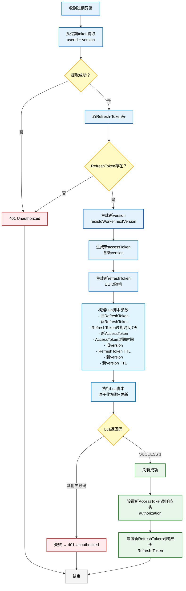

# 刷新过期token流程

```mermaid
flowchart TD
  A[收到过期异常] --> B[从过期token提取<br>userId + version]
  B --> C{提取成功？}
C -->|否| D[401 Unauthorized] --> END[结束]

C -->|是| E[取Refresh-Token头]
E --> F{RefreshToken存在？}
F -->|否| D

F -->|是| G[生成新version<br>redisIdWorker.nextVersion]
G --> H[生成新accessToken<br>含新version]
H --> I[生成新refreshToken<br>UUID随机]

I --> J[构建Lua脚本参数<br>- 旧RefreshToken<br>- 新RefreshToken<br>- RefreshToken过期时间7天<br>- 新AccessToken<br>- AccessToken过期时间<br>- 旧version<br>- RefreshToken TTL<br>- 新version<br>- 新version TTL]

J --> K[执行Lua脚本<br>原子化校验+更新]
K --> L{Lua返回码}

L -->|SUCCESS 1| M[刷新成功]
L -->|其他失败码| N[失败 → 401 Unauthorized] --> END

M --> O[设置新AccessToken到响应头<br>authorization]
O --> P[设置新RefreshToken到响应头<br>Refresh-Token]
P --> END

style A fill:#e3f2fd,stroke:#1976d2,stroke-width:2px,color:#000
style B fill:#e3f2fd,stroke:#1976d2,stroke-width:2px,color:#000
style C fill:#fff9c4,stroke:#fbc02d,stroke-width:2px,color:#000
style D fill:#ffebee,stroke:#d32f2f,stroke-width:2px,color:#000
style E fill:#e3f2fd,stroke:#1976d2,stroke-width:2px,color:#000
style F fill:#fff9c4,stroke:#fbc02d,stroke-width:2px,color:#000
style G fill:#e3f2fd,stroke:#1976d2,stroke-width:2px,color:#000
style H fill:#e3f2fd,stroke:#1976d2,stroke-width:2px,color:#000
style I fill:#e3f2fd,stroke:#1976d2,stroke-width:2px,color:#000
style J fill:#e1f5fe,stroke:#0288d1,stroke-width:2px,color:#000
style K fill:#e1f5fe,stroke:#0288d1,stroke-width:2px,color:#000
style L fill:#fff9c4,stroke:#fbc02d,stroke-width:2px,color:#000
style M fill:#e8f5e9,stroke:#388e3c,stroke-width:2px,color:#000
style N fill:#ffebee,stroke:#d32f2f,stroke-width:2px,color:#000
style O fill:#e8f5e9,stroke:#388e3c,stroke-width:2px,color:#000
style P fill:#e8f5e9,stroke:#388e3c,stroke-width:2px,color:#000
style END fill:#f5f5f5,stroke:#9e9e9e,stroke-width:2px,color:#000
```
