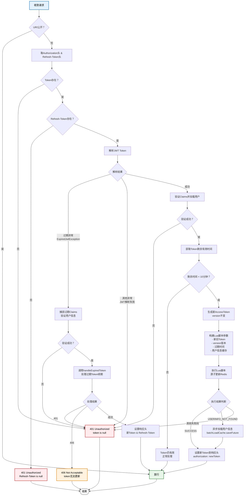

# Refresh拦截器拦截流程

```mermaid
flowchart TD
  A[收到请求] --> B{URI公开？}
B -->|是| Z[放行] --> END

B -->|否| C[取Authorization头 & Refresh-Token头]
C --> D{Token存在？}
D -->|否| E[401 Unauthorized<br/>token is null] --> END

D -->|是| F{Refresh-Token存在？}
F -->|否| E2[401 Unauthorized<br/>Refresh-Token is null] --> END

F -->|是| G[解析JWT Token]
G --> H{解析结果}

H -->|过期异常<br/>ExpiredJwtException| I[捕获过期Claims<br/>验证用户信息]
I --> J{验证成功？}
J -->|否| E
J -->|是| K[调用handleExpiredToken<br/>处理过期Token续期]
K --> L{处理结果}
L -->|401| E
L -->|406| M[406 Not Acceptable<br/>token无法更新] --> END
L -->|成功| N[设置响应头<br/>新Token & Refresh-Token] --> Z

H -->|其他异常<br/>JWT解析失败| E

H -->|成功| O[验证Claims并加载用户]
O --> P{验证成功？}
P -->|否| E

P -->|是| Q[获取Token剩余有效时间]
Q --> R{剩余时间 < 10分钟？}
R -->|否| S[Token仍有效<br/>正常处理] --> Z

R -->|是| T[生成新AccessToken<br/>version不变]
T --> U[构建Lua脚本参数<br/>- 新旧Token<br/>- version版本<br/>- 过期时间<br/>- 用户信息缓存]
U --> V[执行Lua脚本<br/>原子更新Redis]
V --> W{执行结果判断}

W -->|SUCCESS| X[设置新Token到响应头<br/>authorization: newToken]
W -->|USERINFO_NOT_FOUND| Y[异步加载用户信息<br/>batchLoadCache.saveFuture]
W -->|其他失败码| E

Y --> X
X --> Z

END([结束])

style A fill:#e3f2fd,stroke:#1976d2,stroke-width:2px,color:#000
style Z fill:#e8f5e9,stroke:#388e3c,stroke-width:2px,color:#000
style E fill:#ffebee,stroke:#d32f2f,stroke-width:2px,color:#000
style E2 fill:#ffebee,stroke:#d32f2f,stroke-width:2px,color:#000
style M fill:#fff3e0,stroke:#f57c00,stroke-width:2px,color:#000
style END fill:#f5f5f5,stroke:#9e9e9e,stroke-width:2px,color:#000
```
