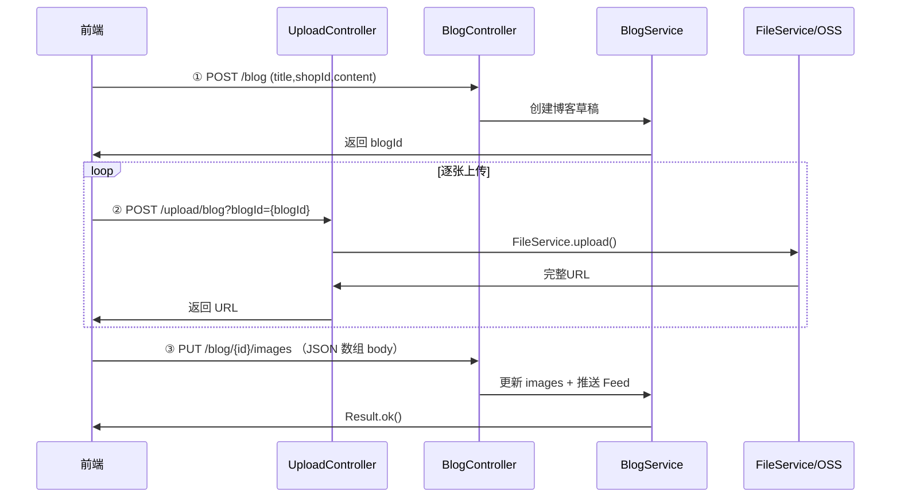

# 博客图片上传方案

> 黑马点评博客发布 + 图片上传流程设计  
> 2026-07

---

## 1. 业务流程



### 关键变化

| 项目 | 原流程 | 新流程 |
|------|--------|--------|
| 博客创建 | 最后一步（含 images） | **第一步**（无 images） |
| 上传时机 | 先传图，后建博客 | **先建博客，后传图** |
| URL 格式 | `/blogs/{d1}/{d2}/{uuid}.{ext}` | `/blogs/{blogId}/{uuid}.{ext}` |
| images 更新 | 创建时一并写入 | **单独 PUT 更新** |

---

## 2. URL 设计

### 2.1 格式

```
{domain}/imgs/blogs/{blogId}/{uuid}.{ext}
         ↑     ↑       ↑        ↑
       Nginx  模块   博客ID    UUID.后缀
```

### 2.2 示例

| 环境 | 示例 |
|------|------|
| 开发（本地） | `http://localhost:8082/imgs/blogs/123/a1b2c3d4.jpg` |
| 生产（OSS） | `https://hm-dp.oss-cn-hangzhou.aliyuncs.com/blogs/123/a1b2c3d4.jpg` |

### 2.3 设计要点

- **blogId 做目录**：天然按博客分组，运维方便，同时起到 OSS 目录散列作用（无需 `{d1}/{d2}` 哈希）
- **UUID 防覆盖**：相同博客相同后缀名的文件不会冲突
- **模块名 `blogs`**：与存量数据 `/imgs/blogs/...` 兼容

---

## 3. API 设计

### 3.1 创建博客（无图片）

```
POST /blog
Content-Type: application/json

{
  "shopId": 1,
  "title": "探店标题",
  "content": "探店内容描述..."
}
```

| 字段 | 类型 | 必填 | 说明 |
|------|------|:----:|------|
| `shopId` | Long | 是 | 关联商铺ID |
| `title` | String | 是 | 笔记标题 |
| `content` | String | 否 | 文字描述 |

> **注意**：此接口**不接收** `images` 字段。图片在博客创建后通过上传接口逐张添加。

**响应**：`Result`，data 为 blogId

```json
{
  "success": true,
  "data": 123
}
```

### 3.2 上传图片

```
POST /upload/blog?blogId={blogId}
Content-Type: multipart/form-data

file: <图片文件>
```

| 参数 | 类型 | 必填 | 说明 |
|------|------|:----:|------|
| `blogId` | Long | 是 | 所属博客ID（路径参数） |
| `file` | MultipartFile | 是 | 图片文件 |

> **校验**：仅允许 jpg/jpeg/png/gif/webp，单文件 ≤5MB

**响应**：`Result`，data 为完整 URL

```json
{
  "success": true,
  "data": "http://localhost:8082/imgs/blogs/123/a1b2c3d4.jpg"
}
```

### 3.3 更新博客图片列表

```
PUT /blog/{id}/images
Content-Type: application/json

["url1", "url2", "url3"]
```

| 参数 | 位置 | 类型 | 必填 | 说明 |
|------|------|:----:|:----:|------|
| `id` | Path | Long | 是 | 博客ID |
| `images` | Body | String[] | 是 | 图片完整 URL 的 JSON 数组 |

> **说明**：
> - 以 **JSON 数组** 形式提交（`PUT` body 直接传数组），替代原来的逗号拼接 URL 方式
> - 避免 URL 本身含逗号导致切分错误，也避免 HTTP 头长度限制
> - 后端将数组转为逗号分隔字符串存储，前端读取时仍用 `getImageUrl()` 处理

**响应**：`Result`

```json
{
  "success": true
}
```

---

## 4. 后端实现要点

### 4.1 UploadController 改造

```java
@PostMapping("blog")
public Result uploadImage(
        @RequestParam("file") MultipartFile image,
        @RequestParam("blogId") Long blogId) {    // ← 新增 blogId 参数
    // 文件类型校验
    // 文件大小校验
    String url = fileService.upload(
            image.getInputStream(),
            image.getOriginalFilename(),
            "blogs/" + blogId);                    // ← module = "blogs/{blogId}"
    return Result.ok(url);
}
```

### 4.2 FileService 双实现适配

两种实现只需把 `module` 参数按 `"blogs/{blogId}"` 传入即可，接口本身不变：

**Object Key / 本地路径**：`blogs/{blogId}/{uuid}.{ext}`

```
# 本地
E:\nginx-1.18.0\html\hmdp\imgs\blogs\123\a1b2c3d4.jpg

# OSS
hm-dianping-images/blogs/123/a1b2c3d4.jpg
```

### 4.3 BlogController 新增接口

```java
@PostMapping
public Result saveBlog(@RequestBody Blog blog) {
    // 创建博客（不含 images），返回 blogId
    return blogService.saveBlogDraft(blog);
}

@PutMapping("/{id}/images")
public Result updateBlogImages(
        @PathVariable("id") Long id,
        @RequestBody List<String> images) {
    return blogService.updateBlogImages(id, images);
}
```

### 4.4 BlogService 调整

```java
// 新增：创建草稿（不推送Feed）
public Result saveBlogDraft(Blog blog) {
    blog.setUserId(UserHolder.getUserId());
    blog.setImages("");          // 初始无图片
    boolean ok = save(blog);
    if (!ok) return Result.fail("创建失败");
    return Result.ok(blog.getId());
}

// 新增：更新图片 + 推送Feed（接收 JSON 数组）
@Transactional
public Result updateBlogImages(Long id, List<String> images) {
    Blog blog = getById(id);
    if (blog == null) return Result.fail("博客不存在");
    String imagesStr = (images == null || images.isEmpty()) ? "" : String.join(",", images);
    blog.setImages(imagesStr);
    boolean ok = updateById(blog);
    if (!ok) return Result.fail("更新失败");
    // 首次设置图片时推送Feed
    pushToFansFeed(blog);
    return Result.ok();
}
```

---

## 5. 孤儿图片清理

### 5.1 场景

用户上传图片后未调用 `PUT /blog/{id}/images`（如关闭浏览器、网络中断），导致：

- 本地磁盘 / OSS 中存在 `blogs/{blogId}/` 目录下的文件
- DB 中该博客的 `images` 字段为空
- 这些图片永远不会被展示，白白占用存储

### 5.2 方案：定时批量清理

```java
@Component
@Slf4j
@Profile("prod")  // dev 环境可手动触发
public class OrphanImageCleanupJob {

    @Resource
    private FileService fileService;

    /**
     * 每天凌晨 3 点执行
     */
    @Scheduled(cron = "0 0 3 * * ?")
    public void cleanupOrphanImages() {
        // 1. 扫描 OSS 本地磁盘 blogs/ 目录下所有 blogId 子目录
        // 2. 查询 DB，过滤出已不存在的 blogId
        // 3. 删除这些目录及其下所有文件
        // 4. 记录日志
    }
}
```

> dev 环境建议暴露一个 `POST /admin/cleanup-orphans` 接口，方便手动触发调试。

### 5.3 清理条件

清理 **创建超过 24 小时** 且 **images 字段为空** 的博客及其关联图片：

```sql
-- 待清理的博客
SELECT id FROM tb_blog
WHERE (images IS NULL OR images = '')
  AND create_time < NOW() - INTERVAL 24 HOUR
```

---

## 6. 前端适配

### 6.1 发布流程

```typescript
// ① 创建博客
const blogRes = await axios.post('/blog', {
    shopId: 1,
    title: '探店标题',
    content: '探店内容...'
});
const blogId = blogRes.data.data;

// ② 逐张上传图片
const imageUrls: string[] = [];
for (const file of selectedFiles) {
    const formData = new FormData();
    formData.append('file', file);
    const uploadRes = await axios.post(`/upload/blog?blogId=${blogId}`, formData);
    imageUrls.push(uploadRes.data.data);
}

// ③ 提交最终图片列表（JSON 数组）
await axios.put(`/blog/${blogId}/images`, imageUrls);
```

### 6.2 图片选择器 UI 建议

- 支持多选图片（不超过 9 张）
- 逐张上传，显示上传进度条
- 上传失败可重试单张
- 未完成的发布可删除已上传图片

---

## 7. 涉及文件变更

| 操作 | 文件 | 说明 |
|:----:|------|------|
| ✏️ 修改 | `UploadController.java` | uploadImage 加 `@RequestParam blogId` |
| ✏️ 修改 | `BlogController.java` | 拆分 saveBlog → ① 创建 ② 更新 images |
| ✏️ 修改 | `BlogServiceImpl.java` | 新增 saveBlogDraft / updateBlogImages |
| ✅ 新建 | `schedule/OrphanImageCleanupJob.java` | 定时清理孤儿图片 |
| ✏️ 修改 | `前端开发文档.md` §5.4.1 | 更新流程说明 |
| ✏️ 修改 | `前端开发文档.md` §5.8 | 更新上传参数说明 |

---

## 8. 不涉及变更

- `FileService` 接口 — 不变，module 参数传 `"blogs/{blogId}"` 即可
- `LocalFileServiceImpl` — 不变
- `OssFileServiceImpl` — 不变
- `OssConfig` — 不变
- Blog 实体 — 不变（images 字段已存在）
- 存量数据 — 不变（老数据 `/imgs/blogs/{d1}/{d2}/...` 由 `getImageUrl()` 兼容）

---

## 9. 审查问题清单

> 以下问题来自 2026-07 全量安全/接口/数据一致性审查，归属本文档（博客图片上传方案）。

### 9.1 🔴 安全风险

| # | 问题 | 级别 | 建议 |
|:-:|------|:----:|------|
| S3 | **PUT /blog/{id}/images 未校验作者身份** — 可篡改他人博客图片列表 | 🟠 P1 | 在 `updateBlogImages()` 中校验当前用户是否为博客作者 |

### 9.2 🟠 接口设计缺陷

| # | 问题 | 级别 | 建议 |
|:-:|------|:----:|------|
| I1 | **逗号拼接 URL 有缺陷** — URL 含逗号则切分错误；长度受 HTTP 头限制（约 8KB），图片较多时被截断 | 🟠 P1 | 改为 JSON 数组 `["url1","url2"]` 或 `multipart/form-data` 多文件上传 |
| I2 | **覆盖写入导致并发丢失** — `images` 字段整体替换，后提交覆盖先提交 | 🟠 P1 | 使用乐观锁（version）或基于当前值追加 |

### 9.3 🟠 数据一致性问题

| # | 问题 | 级别 | 建议 |
|:-:|------|:----:|------|
| D3 | **images 字段空值处理不统一** — 允许 NULL 或空串，查询条件冗余 | 🟢 P3 | 统一为 `DEFAULT ''` |

### 9.4 🟠 业务逻辑问题

| # | 问题 | 级别 | 建议 |
|:-:|------|:----:|------|
| B1 | **updateBlogImages 每次调用都 pushToFansFeed** — 多次更新图片造成粉丝端消息轰炸 | 🟠 P1 | 仅在最终发布时推送 Feed（如增加发布状态位） |
| B2 | **上传取消/异常关闭无回滚** — 已上传的临时文件成孤儿 | 🟢 P3 | 前端提供"取消发布"功能，通知后端清理 |
| B3 | **POST /blog 未校验 shopId 存在性** — 关联商铺可能无效 | 🟢 P3 | 在 Service 层校验 shopId 是否存在 |

### 9.5 文档一致性问题

| # | 问题 | 级别 | 建议 |
|:-:|------|:----:|------|
| C1 | **路径前缀不统一** — §2 使用 `/blogs/`，§5.2 使用 `/imgs/blogs/`，§4.2 使用 `blogs/` | 🟢 P3 | 统一为 `/imgs/blogs/` |
| C2 | **module 名单复数不一致** — 接口传入 `"blogs"` 但文档部分描述写 `"blog"` | 🟢 P3 | 统一为 `"blogs"`（与存量兼容） |
